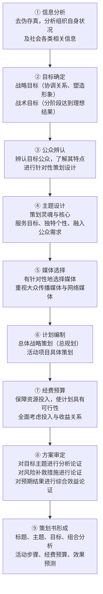
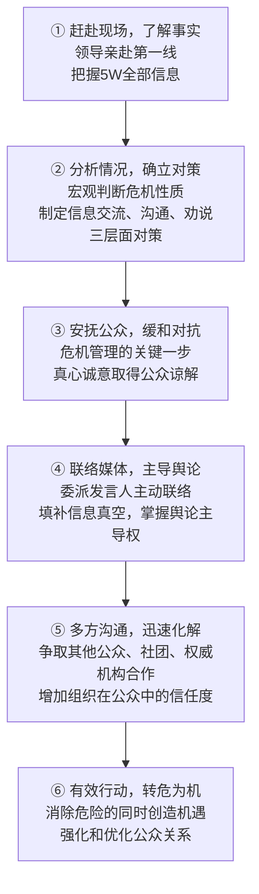

# 公共关系重点整理

## 一、全员公关

### 1. 定义

全员公关是指社会组织中**所有工作人员都参与公共关系活动**的观念，简称"全员 PR"。

其意义在于：增强组织全体人员的公关意识，促使他们更多地关心组织，不断提高自身素质，从本职工作入手，把公关工作贯穿于组织的各项工作中，为树立良好的组织形象奠定基础。

> [!note] "全员"的含义
> "全员"不仅指公众中每个可能与组织发生直接或间接联系的个人，**也包括组织内部作为个体的每个成员**。

### 2. 作用及意义

1. 全员公共关系氛围是树立企业良好形象的**基础**
2. 领导层的公关意识是树立企业良好形象的**关键**
3. 全员公共关系配合是树立企业良好形象的**前提**

### 3. 全员公关管理三要素

**领导的公关意识 + 全员的公关配合 + 浓郁的公关氛围**

### 4. 实现企业全员公关的途径

1. 切实保障企业职工的主人翁地位
2. 培养职工对企业的认同感和归属感
3. 激发职工的自豪感
4. 开展全员公共关系教育与培训

---

## 二、公共关系的公众

### 1. 定义

**公众**：任何与组织发生直接或间接联系的、正在或将会影响到它的形象塑造和组织目标实现的**特定社会群体**。公众是公共关系的**客体**。

### 2. 基本特性

| 特性 | 含义 |
|------|------|
| **同质性** | 公众成员面临相同或相似的问题，对问题抱有相同或相似的看法，行动上具有相同或相似的倾向 |
| **相关性** | 公众必须与组织相关，须界定组织目标和利益与各类公众目标和利益的相关之处 |
| **特定性** | 公众处于特定环境中，在特定领域面临特定问题，并由此与特定组织发生特定关系 |
| **可变性** | 公众随组织运行的动态过程而变化，同质性、相关性、特定性均包含可变性 |

### 3. 公众的分类

#### 横向分类（同质性分类，即问题导向分类）

1. **内部公众**：组织内部的所有成员
2. **政府公众**：对组织实行管理监督职能的政府及其管理部门
3. **顾客公众**：组织所经营的产品或服务的消费群体
4. **事件性公众**：由突发性天灾、人祸、事件而形成的公众
5. **媒体公众**：专事向社会传播信息、沟通意义、劝说态度的组织（既是组织的公众，又是组织与其他公众沟通的中介）
6. **社区公众**：社会组织所在地方方面面的组织和公众群体
7. **同行公众**：属于同一行业的组织或业主

#### 纵向分类（按公众自身状态及发展阶段划分）

---

## 三、公共关系的作用

**定义**：公共关系机构或从业人员在具体履行职责和功能的过程中所产生的影响和效用。

### 1. 监测作用

在对信息资源筛选的基础上，对公共关系主体和客体的行为或态度实行监测所获得的结果（组织的**反馈功能**）。

- **对内监测**：通过信息采集、处理和反馈，把握组织内外的细微变化，监测组织运行状态和目标实现的可行性
- **对外监测**：及时掌握与组织有关的各种信息及走向，监视和预测公众态度及行为变化趋势，监测重点在于**大众传播媒介**

### 2. 凝聚作用

使人的能动性对组织含有的潜在负面影响向正面效能转化，使组织内部上下一心、团结一致。通过信息交流、人际互动沟通组织成员的心理情感，具有**持久性**。

### 3. 调节作用

体现在微观层面的经常性调节：
- 对各种日常摩擦的调节（减少摩擦系数）
- 及时防止矛盾扩大（最大限度减少纠纷危害）

### 4. 应变作用

组织形象受损或与公众关系遭到破坏时的特殊作用：

| 情形 | 处理方式 |
|------|---------|
| **因自身原因受损** | 应变作用：先假定公众是对的，及时作出应变，改变组织运行状况以改善形象 |
| **因外部原因受损** | 抵御作用：主要采用**柔性的信息传播手段**，避免刚性手段无路可退的缺点；协调失败后可诉诸刚性手段 |

---

## 四、公共关系的四步工作法

> [!important] 核心框架
> 四步工作法将整个公共关系工作过程划分为四个基本阶段：**公关调查 → 公关策划 → 公关实施 → 公关评估**，四个步骤相互衔接、循环往复，形成动态的环状模式。

---

### （一）公关调查

#### 1. 含义

公共关系人员运用科学的、**定量分析与定性分析相结合**的方法，有目的、按计划、分步骤地考察组织的公共关系历史和现状，分析相关因素及相互关系，预测发展趋势，解决公共关系问题的一种实践活动。

#### 2. 调查的四项原则

| 原则 | 含义 |
|------|------|
| **全面性** | 依据"大数定律"，大量观察使样本与总体平均值接近；着重选取典型作重点调查 |
| **代表性** | 从总体中抽取样本，确保每个个体获得"均等抽取""随机抽取"的机会 |
| **客观性** | 统一尺度标准，在问卷设计中对每个问题和概念进行确切的含义规定，减少误差 |
| **定量化** | 运用统计学原理规划调查；用数学模型搜集和分析资料；用数学关系表达结论 |

#### 3. 调查过程

公关调查贯穿于公关活动的全过程，其结果评估与应用是将调查结论对照课题目标进行比较和验证，既可促使新决策形成，也可成为新的调查课题。

---

### （二）公关策划

#### 1. 含义

公关人员为实现组织的公关目标，在充分调查研究的基础上，对组织的公关战略和具体公关操作进行**谋略计划和设计**的工作。它是策划理论在公关活动中的具体运用，是**"四步工作法"的灵魂与核心**。

#### 2. 策划的四项原则

1. **整体性与目的性**：立足全局，与整体公关活动协调，各要素环环相扣，实行最优化选择
2. **独创性与连续性**：根据环境条件进行有独创性的策划；形象建设需多次积累，独创性要与连续性统一
3. **计划性与灵活性**：方案应保持相应稳定性；同时对可能的变化留有充分余地，留出灵活应变空间
4. **客观性与可行性**：坚持以客观事实为依据；方案必须行之有效，需进行可行性分析

> [!tip] 可行性把握的四个要点
> 1. 权衡方案利害得失，综合考虑
> 2. 遵循经济性原则，效益效率相统一
> 3. 确保方案科学性，创造性思维与科学想象相统一
> 4. 检测方案的合法性，符合法律法规和相关方针政策

#### 3. 策划的创造性

公关策划的本质是**创新**，灵魂是**创造性思维**。五种创造性思维方法：
1. 灵感的激发
2. 想象的突破
3. 因素的巧妙组合
4. 思维的超常
5. 思维的碰撞

#### 4. 策划的九个步骤

---

### （三）公关实施

#### 1. 含义与意义

公共关系实施是公共关系主体为实现既定目标，对公关创意策划进行**实施策略、手段、方法设计并进行实际操作与管理**的过程。

- 是解决公共关系问题和实现目标的**重点环节**
- 决定策划创意能否实现及实现的程度和范围
- 实施结果是后续策划的**重要依据与起点**

#### 2. 主要内容

1. 由经理层执行的有关加强或调整组织政策、行为的活动
2. 由公共关系部门执行的公共关系传播活动

#### 3. 特点与原则

**特点：** 艺术性、文化性、人情性、形象性、关系性、传播性

**原则：** 准备充分、策划导向、控制进度、整体协调、反馈调整

#### 4. 实施中应注意的问题

1. 既要注意统筹管理、全盘协调控制，又要相信别人
2. 注意**组织行为和传播**的配合
3. 注意对各种信息制作的质量进行控制，严格把关
4. 对各种具体媒介的时间或空间购买，严格按照媒介战略要求执行
5. 注意照顾不同类型公关活动的特点
6. 注意对公共关系策略的把握

---

### （四）公关评估

#### 1. 含义

公共关系评估是指有关组织或机构依据科学的标准和方法，对公共关系的**准备过程、整体策划、实施过程及活动效果**进行测量、检查、评估和判断的一种活动。

评价工作三个环节：
1. 重温公关目标，作出自我评价
2. 收集分析资料，接受专家评价
3. 报告分析结果，用于决策参考

#### 2. 意义

1. 改进公共关系工作的重要环节
2. 开展后续公共关系工作的必要前提
3. 鼓舞士气、激励内部公众的重要形式
4. 承上启下，为进一步开展公关活动提供依据
5. 为企业管理提供决策参考
6. 增强公关意识，提高公关人员的工作信心
7. 衡量公共关系活动的效益

#### 3. 评估程序

1. 设立统一的评估目标
2. 取得组织最高管理者的认可，将评估过程纳入公关计划
3. 在公共关系部门内部取得对评估研究意见的一致
4. 从可观察与测量的角度将目标具体化、明确化、准确化
5. 选择适度的评估标准
6. 确定搜集证据的最佳途径
7. 保持完整的计划实施记录
8. 评估结果的使用
9. 将评估结果向组织领导层报告

#### 4. 评估标准与方法

| 评估层面 | 关注要点 |
|---------|---------|
| **准备过程** | 背景材料是否充分；信息内容是否准确充实；信息表现形式是否恰当 |
| **实施过程** | 发送信息数量；被传播媒介采用数量；接收到信息的目标公众数量；注意信息的公众数量及传播实际效果 |
| **实施效果** | 了解信息内容的公众数量；改变观点态度的公众数量；发生期望行为的公众数量；达到的目标和解决的问题；对社会和文化发展产生的影响 |

**评估方式（三种综合运用）：**
1. 评估人员的直接观察
2. 对实施者和实施对象进行调查
3. 分析各种汇报资料

#### 5. 评估注意事项

1. 定性分析与定量分析相结合
2. 长远效益分析与近期效益分析相结合
3. 标准与变化性的统一

---

## 五、公共关系调查的意义和作用

公关调查的实质是一种**获取信息的工作**，通过了解特定公众的观点、态度和反应，找出问题及其主要原因，制定切合实际的公关计划和方案。

1. **为科学决策提供依据**：及时掌握公众需求变化，防止计划的盲目性和决策的任意性，避免主观主义
2. **增强应对突发事件能力**：了解组织内外部关系现状及社会大环境，对外部环境波动规律有深刻认识
3. **促进改善管理、提高效益**：了解组织在市场竞争中的地位，找出综合管理水平上的差距，对生产经营起监测和预警作用
4. **有利于树立组织社会形象**：测定组织形象实际状态，为形象建设提供针对性依据；调查愈全面充分，形象建设工作见成效的可能就愈大

---

## 六、危机传播管理的基本程序

> [!warning] 第三步是关键
> 安抚公众、缓和对抗是危机传播管理的**关键一步**。即使有千条减轻自身罪错的理由，也应先安抚受害公众，真心诚意取得谅解，而非掩盖、搪塞、自我表白。

> [!tip] 危机的双重含义
> 危机是"变好或变坏的转折点"。成功的危机处理不仅能消除危险，还能**创造机遇**，迅速获得公众理解和谅解，进一步强化和优化公众关系。

---

## 七、"3T"原则

> [!info] 背景
> 危机处理的"3T"原则由**英国危机公关处理专家里杰斯特**提出，强调危机处理时把握信息发布的重要性。运用时须服从"特殊危机，特殊处理"的大原则。

### T1：Tell your own tale（以我为主提供情况）

强调危机处理时组织应牢牢**掌握信息发布的主动权**，信息的发布地、发布人都要从"我"出发，增加信息保真度，主导舆论，避免信息真空。

操作上应贯彻执行**"发言人"制度**；危机发生在外地时，应立即派"特派专员"赶赴现场掌握第一手资料。

强调"我方的调研""我方的见证""我方的事实"：面对危机，不慌不乱，态度诚恳，言辞得体，可据实力辩、据理力争，尽快把握局面。

### T2：Tell it fast（尽快提供情况）

强调危机处理时组织应**尽快且不断地发布信息**。

> [!note] 注意
> 并不总是越快越好。在关键事实未弄清之前，在特殊国际环境或政治情势下，**该等的要等，该压的要压**，一切视情势而定。

危机管理小组需在设备齐全的**危机控制中心**办公，设备应包括：充足通话线路（至少一条专线）、足够内线电话、无线电设备、危险情况显示图（危险物质方位、安全设备位置、灭火水源系统、工厂通道状况等）、应急调度显示图、记录用文具、雇员名录、重要人物地址及电话等。

### T3：Tell it all（提供全部情况）

强调信息发布应**全面、真实，实言相告**。越是隐瞒真相越会引起更大的怀疑。

> [!warning] 正确理解"全部"
> 任何危机处理都不可能提供绝对全部的情况，应理解为**"该全部提供的就全部提供"**。对于可能引起社会动荡、易被敌对势力利用的情况，不仅不能提供，还要有思路和谋略地应对，对"全部情况"逐一梳理，**有报有压**，以利扬正克邪，转危为安。
