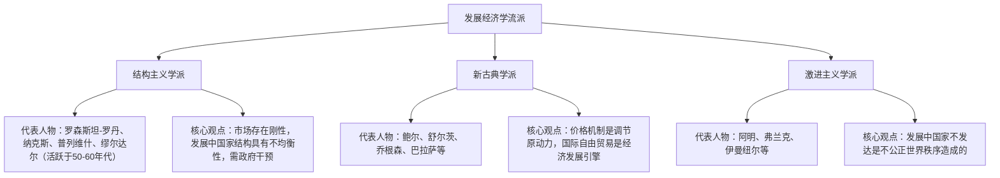
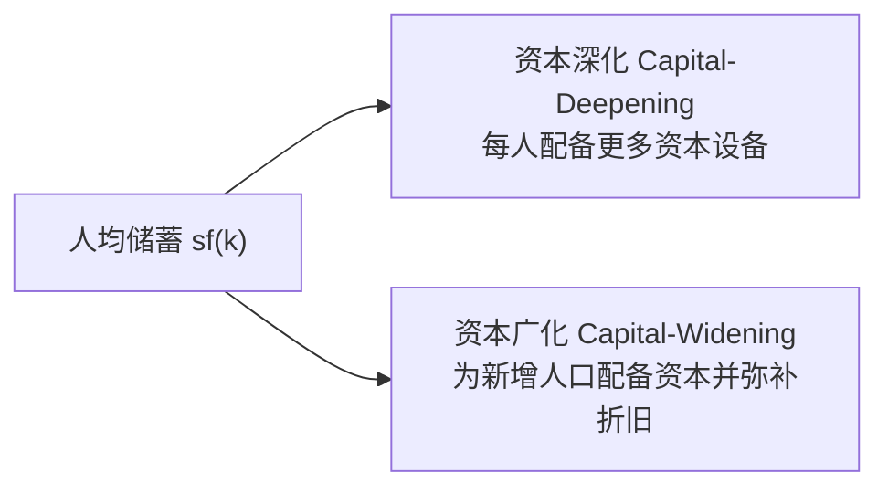
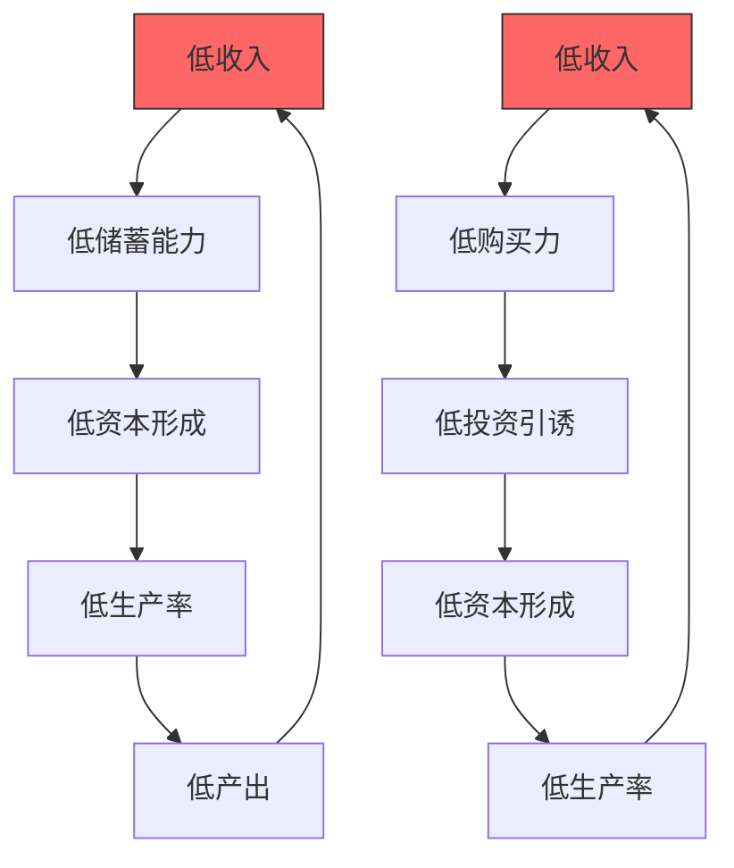
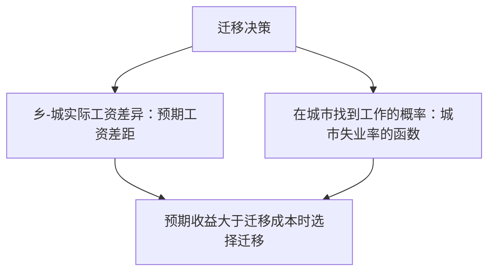
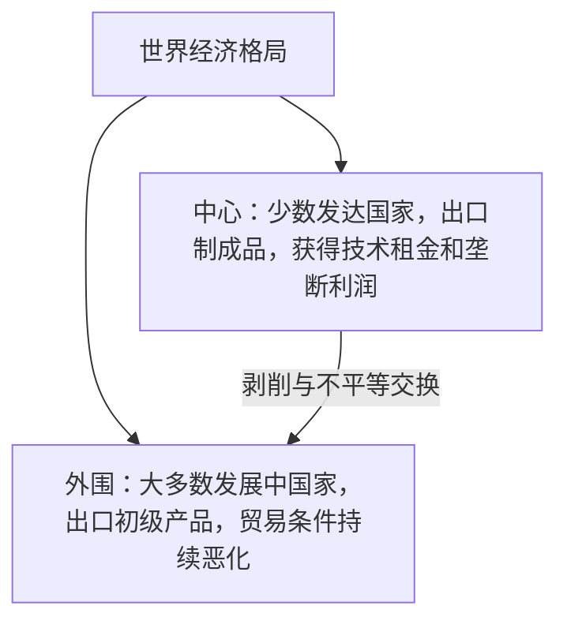

# 发展经济学复习要点

## 第一章 导论

### 一、发展中国家的共同特征

> [!info] 核心特征概览
> 发展中国家的不发达状态是多维度的，既有经济层面的困境，也有社会结构性的缺陷。

1. 生产率水平低
2. 人均收入低
3. 人口负担严重
4. 高水平的失业和不充分就业
5. 对农业生产和初级产品出口的严重依赖
6. 经济、社会和政治的**二元结构**

---

### 二、千年发展目标（MDGs）

> [!note] 背景
> 千年发展目标由联合国于2000年提出，旨在到2015年实现全球减贫与可持续发展。

1. 根除极端贫困和饥饿
2. 普及初等教育
3. 促进男女平等并赋予女性权利
4. 降低儿童死亡率
5. 改善母亲健康
6. 与艾滋病、疟疾和其他疾病作斗争
7. 确保环境的可持续性
8. 建立全球性的发展伙伴关系

---

### 三、发展经济学的主要流派

#### 1. 结构主义学派

**代表人物：** 罗森斯坦-罗丹、纳克斯、普列维什、辛格、缪尔达尔（活跃于50—60年代）

**基本观点：**
- 新古典经济学只适合市场经济高度发达的国家，不适合发展中国家
- 发展中国家的社会经济结构是具有**刚性的不均衡结构**，而非自动均衡体系

**结构主义的基本模型：**
- **二元经济模型（刘易斯）**：建立在需求互补性基础上的平衡增长模型，考察发展中国家内部结构缺陷
- **中心—外围理论（普雷维什）**：考察外部结构缺陷对发展中国家的巨大负面影响

#### 2. 新古典学派

**代表人物：** 鲍尔、瓦伊纳、哈伯勒、舒尔茨、迈因特、乔根森、巴拉萨、纽金特等

**基本观点：**
- 经济发展是连续渐进的过程，没有社会经济的飞跃
- 劳动与资本可以相互替代
- **价格机制**是一切调节的原动力
- **国际自由贸易**是经济发展的引擎

#### 3. 激进主义学派

**代表人物：** 阿明、弗兰克、伊曼纽尔等

**基本观点：** 发展中国家的不发达状态是由**不公正的世界秩序**造成的

---

## 第三章 经济增长与发展理论

### 一、经济增长与经济发展的内涵

> [!important] 核心区分
> **增长**侧重数量，**发展**侧重结构变革与质量提升，二者不可混淆。

| 概念 | 定义 | 衡量指标 |
|------|------|---------|
| **经济增长** | 一定时期内产品和劳务数量的增加，或人均实际产出的增加 | GNP、GDP、国民收入（NI）及其人均值 |
| **经济发展** | 除增长外，还伴随着经济结构、社会和政治体制的变革 | 农业比重下降、制造业比重上升、就业结构变化、劳动力素质提高 |

### 二、增长与发展的关系

1. **增长是发展的基础**：经济增长是手段，经济发展是目的；经济增长是经济发展的基础，经济发展是经济增长的结果
2. **增长不是发展的充分条件**：有增长不一定有发展，需防止"无发展的增长"

---

### 三、主要经济增长理论

#### 1. 哈罗德—多马模型（Harrod-Domar Model）

> [!tip] 模型核心思想
> GNP增长率由**储蓄率**和**资本—产出比**共同决定：储蓄率越高增长越快，资本—产出比越高增长越慢。

**基本假设：**
- 全社会只生产一种产品，既可消费又可生产
- 只有劳动和资本两种要素，**比例固定不变**（不可相互替代）
- 规模报酬不变，不存在技术进步

**核心公式：**

$$g = \frac{s}{k}$$

其中：$g$ = 经济增长率；$s$ = 储蓄倾向（储蓄/国民收入）；$k$ = 资本—产出比（生产单位产出所需资本量）

**结论：**
- GNP增长率与储蓄率成**正比**
- GNP增长率与资本—产出比成**反比**

**意义：**
- 发展了凯恩斯理论
- 强调"资本积累"的决定作用
- 为政府干预提供理论依据
- 更适合发展中国家

**局限性：**
- 资本—产出比不变的假设脱离现实
- 过分强调资本作用，忽视技术进步和人力资本
- 忽视了市场机制的作用

---

#### 2. 索洛—斯旺模型（Solow-Swan Model）

> [!tip] 模型核心思想
> 与哈多模型不同，索洛模型允许资本与劳动**可以相互替代**，引入了**稳态**概念，并首次强调技术进步是经济增长的最重要贡献者。

**基本假设：**
- 资本与劳动存在**替代关系**，资本产出比可以改变
- 规模收益不变，资本与劳动的边际生产率递减
- 市场完全竞争，价格机制起主要调节作用
- 技术进步是中性的

**核心方程：**

$$sf(k) = \Delta k + (n + \delta)k$$

其中：$s$ = 储蓄率；$f(k)$ = 人均产量；$n$ = 人口增长率；$\delta$ = 固定资产折旧率；$k$ = 人均资本量

**人均储蓄的去向：**

**稳态条件（经济长期均衡）：**

$$sf(k^*) = (n + \delta)k^*$$

> 在稳态中，总产出和资本存量的增长率均等于劳动力增长率，即经济增长率 $g = n$。

**意义：**
- 假定生产要素具有相互替代性
- 第一次提出"**技术进步对经济增长具有最重要的贡献**"
- 说明经济增长中收入分配的趋势

**缺陷：**
- 生产要素可任意替代的假设不切实际
- 自由市场完全自动均衡的假设与现实不符

---

#### 3. 新经济增长理论（内生增长理论）

> [!info] 理论突破
> 新经济增长理论将**知识、人力资本**等纳入模型，使技术进步内生化，突破了新古典理论的"外生技术进步"局限。

**基本思想：**
- 揭示经济**长期增长**的机制和源泉
- 研究世界范围的增长、收入分配与发展不平衡问题
- 经济增长是经济体系**内部力量**（内生技术变化）的产物
- 知识、人力资本等因素使资本收益率可以不变或递增，人均产出可以无限增长

**主要贡献：**
- 突破新古典增长理论的局限
- 强调**劳动分工制度**的作用
- 将技术（知识）内生化，与信息时代结合
- 解释了国际金融领域"**资本反向流动**"现象

**局限性：**
- 仍无法解决总量生产函数问题
- 强调人力资本和技术知识，忽视制度要素
- 数学技巧运用过多，方程组过于复杂

---

#### 4. 罗斯托的经济增长阶段理论

**经济增长六阶段：**

> [!warning] 重点：起飞阶段
> "起飞"是发展中国家向发达国家过渡的关键阶段，要求在短时间内实现经济结构和生产方式的剧烈转变。

**经济起飞的条件：** 科学思想条件、社会条件、政治条件、经济条件

**经济增长的原因：**
- 客观原因：主导部门的依次更替
- 主观原因：人类欲望的不断更替

---

## 第五章 资本形成与金融发展

### 一、物质资本

**含义：** 在一定时间内用来生产其他产品（消费品和投资品）的物品。

**特点：**
- 物质资本是投资过程的结果
- 代表本期生产能力，也代表未来生产能力
- 具有耐用性

---

### 二、资本匮乏对经济发展的障碍

#### （1）纳克斯的"贫困恶性循环"理论

> [!danger] 贫困恶性循环
> 资本稀缺是产生贫困恶性循环的根本原因，必须从供给和需求两方面同时打破循环。

**政策含义：**
- 供给方面：扩大储蓄 → 增加资本 → 提高生产能力
- 需求方面：扩大投资 → 提高收入 → 扩大需求

#### （2）莱宾斯坦的"最小临界努力"理论

**观点：** 发展中国家必须有足够高的**初始大规模投资**，使"提高收入的力量"大于"降低收入的力量"，推动经济跳出"低水平均衡陷阱"。

#### （3）罗森斯坦—罗丹的"大推进"理论

**核心观点：**
- 发展中国家必须发展工业，以摆脱贫穷落后状态
- 必须大规模进行**基础设施投资**（资本供给的不可分性）
- 需要整体推进的投资政策，而非零散投入

> [!note] 三大理论比较
> | 理论 | 提出者 | 核心主张 |
> |------|--------|---------|
> | 贫困恶性循环 | 纳克斯 | 从供需两方面同时打破循环 |
> | 最小临界努力 | 莱宾斯坦 | 投资规模须超过临界点才能脱困 |
> | 大推进理论 | 罗森斯坦-罗丹 | 基础设施大规模整体投资 |

---

### 三、金融抑制与金融自由化

#### 金融抑制（Financial Repression）

**含义：** 政府过分干预金融市场，对金融市场施加限制，使金融市场发生扭曲的现象。

**主要表现：** 金融机构不发达、银行信用受限、政府财政赤字掠取银行放款资金等。

**消极作用：**
- 缩小或压低金融体系规模
- 降低储蓄水平
- 增加投资需求（但实际供给不足）
- 削弱企业降低成本的动力
- 助长对实物资产的追逐

#### 金融自由化（金融深化）

**含义：** 金融深化是金融抑制的对称，主张改革金融制度，放松对金融机构和市场的限制，使利率、汇率市场化，以提高国内储蓄率，最终抑制通货膨胀、刺激经济增长。

**主要方面：** 利率自由化、混业经营、业务范围自由化、金融机构准入自由、资本自由流动。

> [!warning] 风险提示
> 金融自由化的各主要方面均有引发**金融脆弱性**的可能，需审慎推进。

---

## 第六章 人口、人力资本与就业

### 一、人口转变理论

**人口转变**是指按出生率与死亡率的变动关系，联系社会经济发展，人口增长演变的三个阶段之间的相继转化。

**三阶段划分：**

---

### 二、马尔萨斯人口陷阱

> [!danger] 人口陷阱
> 人均收入增加 → 生活条件改善 → 人口增长加速 → 人均收入被抵消，形成循环困境。

**脱困路径：**
1. **抑制人口增长**
2. **大规模投资**，使人均收入增长率超过人口增长率，一举突破陷阱

**批评：**
- 未考虑技术进步
- 人口增长率与人均收入的正相关关系未获经济学界证实

---

### 三、人力资本

**含义：** 体现在劳动者身上的、以劳动数量和质量表示的非物质资本。

**两个维度：**
- **量**：劳动者在工作岗位上的劳动成果数量
- **质**：技艺、知识、工作熟练程度、管理水平等

**主要形成途径：**
- 卫生保健设施和服务
- 在职培训
- 正规的初等、中等、高等教育
- 非企业组织的成人在职教育
- 为适应就业机会变化而进行的个人和家庭迁移

---

### 四、发展中国家教育现状

> [!warning] 教育困境
> 发展中国家的教育问题呈现出"量少质差、结构错配"的双重困境。

1. 人均教育投资低
2. 辍学率高
3. 教育与实际需求严重脱节
4. 教育过度与知识性失业并存
5. 智力外流现象严重

---

## 第七章 自然资源与环境

### "增长极限论"

**提出者：** 麦多斯（D. Meadows），1972年发表《增长的极限》。

**核心观点：** 地球自然资源有限，世界人口急剧增加将使人口与资源矛盾恶化，使用自然资源的成本越来越高，人们物质生活水平将显著下降。

> [!info] 背景
> 该书是罗马俱乐部关于人类情况研究计划的第一份研究报告，在全球范围内引发了对经济增长方式的深刻反思。

---

## 第九章 二元经济结构与劳动力转移

### 一、刘易斯模型（Lewis Model）

**基本假定：**
- 发展中国家经济由**现代部门**（工业）和**传统部门**（农业）两个部门组成
- 传统部门存在**劳动无限供给**（边际生产率为零或极低）
- 现代部门工资水平**不变**（略高于传统部门维持生计工资）

**运行机制：** 现代部门利用较高工资吸引农业剩余劳动力，扩大再生产，直至剩余劳动力耗尽（"路易斯转折点"）。

---

### 二、乔根森模型（Jorgenson Model）

**假设：**
- 经济分为**现代部门**和**落后部门**
- 落后部门取决于劳动和土地，不存在资本积累，农业产出是劳动的唯一函数
- 现代部门取决于资本和劳动
- 两部门产出随时间自动增长（技术进步的结果）

**贡献：**
- 加深了对农业部门在经济发展中作用的认识
- 否定工资既定的假设，使模型更接近现实

---

### 三、拉尼斯模型（Ranis Model）

**重要思想：**
1. 强调农业的重要性
2. 工农业要**平衡发展**
3. 技术进步类型对工业部门就业增长的影响

---

### 四、托达罗模型（Todaro Model）

**农村劳动力向城市迁移的两个决定因素：**

> [!note] 政策含义
> 单纯依靠城市就业机会吸引农村劳动力，若城市失业率高，则可能引发大规模农村人口涌入城市却无法就业的困境。

---

### 五、中国的多重二元结构

**现状（四个层面）：**
- 就业结构的二元化
- 社会保障和医疗福利的二元化
- 财政投资政策偏倚固化了二元结构
- 城乡二元税收体制

**原因：**
- 严格户籍制度的实行
- 工农产品价格"剪刀差"

**解决措施：**
- 城市化与工业化协同推进
- 城乡互助
- 深化城乡体制改革

---

## 第十章 农业与农村发展

### 一、农业在经济发展中的作用

| 贡献类型 | 含义 |
|----------|------|
| **产品贡献** | 为非农部门提供粮食和原材料 |
| **市场贡献** | 农民收入增加带动工业品需求 |
| **要素贡献** | 向工业部门输送劳动力和资本 |
| **外汇贡献** | 出口农产品获取外汇 |

---

### 二、农业现代化

**含义：** 传统农业转变为现代农业的过程。

**内容：**
- 物质投入的现代化
- 生产技术的现代化
- 生产的专业化、社会化和区域化
- 生产组织管理方式的现代化
- 农民生活方式的现代化

---

### 三、农业可持续发展

**含义：** 管理和保护自然资源基础，调整技术和机制变化方向，确保持续满足目前和今后世代人们需求的农业发展模式。

---

### 四、绿色革命（Green Revolution）

**含义：** 以技术创新为核心，主要分为**机械（技术）系列**和**生物系列**两大类。

> [!info] 绿色革命的意义与局限
> 绿色革命显著提高了粮食产量，但也带来了土地集中、小农受损、环境问题等争议。

---

## 第十一章 工业化与城市化

### 一、工业化

**含义（张培刚定义）：** 一系列基要生产函数连续发生变化的过程。实质是**经济结构的转化**，即农业份额下降和非农业份额上升。

**工业化模式：**
- 资本主义自由经济工业化模式
- 资本主义不完全市场经济工业化模式
- 社会主义中央计划经济工业化模式
- 社会主义市场经济工业化模式

---

### 二、工业化阶段与霍夫曼定理

**工业化三阶段：**

**霍夫曼定理：**

$$\text{霍夫曼系数} = \frac{\text{消费资料工业净产值}}{\text{资本品工业净产值}}$$

> 随着工业化进展，霍夫曼系数呈**不断下降**趋势。系数越小，重工业化程度越高，工业化水平越高。

---

### 三、城市化

**含义：** 居住在城镇的人口占总人口的比例增长的过程；更确切地说，是农业人口转化并在城市集中的过程。

$$\text{城市化水平} = \frac{\text{城市人口数}}{\text{全国总人口数}}$$

**城市化的两种偏差：**

| 类型 | 特征 | 典型国家 |
|------|------|---------|
| **超前性** | 城市化速度远高于农业和工业生产率增长 | 巴西 |
| **滞后性** | 城市化发展严重滞后于工业化发展 | 中国 |

---

## 第十三章 国际贸易与发展战略

### 一、贸易条件恶化论——"中心—外围"论

**提出者：** 普雷维什（R. Prebisch）等

**发展中国家贸易条件恶化的原因：**
- 初级产品需求弹性低于制成品，需求增长率不同
- 技术进步使初级产品节约和替代成为可能，减少需求
- 制成品价格含技术创新租金和垄断利润，相对价格更高
- 历史上殖民地背景，结构性不利

---

### 二、进口替代发展模式

**含义：** 通过建立和发展本国制造业，**替代过去的制成品进口**，带动经济增长，实现工业化。

**两阶段：**
- **第一阶段：** 发展最终消费品工业，替代消费品进口
- **第二阶段：** 升级换代，转向资本品、中间产品的国内生产

**成效：** 促进制造业发展、提高工业化水平、增强经济自主性

**缺陷：**

> [!warning] 进口替代的主要问题
> - 造成外汇短缺和国际收支失衡，强化对外依赖
> - 资源配置不合理
> - 经济结构不合理
> - 影响经济效益，带动作用有限
> - 未能创造较多就业机会
> - 造成收入分配不合理

---

### 三、出口导向发展模式

**含义：** 使本国工业生产**面向国际市场**，以制成品出口逐步替代初级产品出口。（是对进口替代模式的替代和发展）

**两阶段：**
- **第一阶段：** 以具有比较优势的**劳动密集型轻工业**制成品出口
- **第二阶段：** 以具有动态比较优势的**技术密集型**轻重工业制成品出口

**成效：** 促进经济较快增长、改善经济结构、出口量迅速增长

**缺陷：**
- 增强经济发展的依赖性
- 造成经济结构失衡
- 经济发展脆弱性增加

---

### 四、两缺口分析模型

> [!info] 基本模型
> 在假设 $G = T$（政府收支平衡）的条件下：

$$I - S = M - X$$

| 缺口 | 公式 | 含义 |
|------|------|------|
| **储蓄缺口** | $I - S > 0$ | 所需投资额超过本国储蓄额 |
| **外汇缺口** | $M - X > 0$ | 维持增长所需进口额超过出口额 |

**政策含义：** 外部融资（贷款和赠与）可补充国内资源，解除储蓄和外汇短缺困境。

---

## 名词解释速查

### 经济增长理论类

> [!abstract] 哈罗德—多马模型（自然增长率）
> 自然增长率取决于劳动力年平均增长率和劳动生产率年平均增长率。在资本与劳动、资本与产量的比例既定时，自然增长率是一国能够实现的**最大增长率**，也是实现充分就业的增长率。

> [!abstract] 稳态（Steady State）
> 经济中存在一个**资本存量变动为零**的资本存量水平，此时改变资本的各种力量正好平衡。稳态代表经济的长期均衡，不论初始水平如何，经济终究走向稳态。

> [!abstract] "起飞"理论（罗斯托）
> 起飞阶段是发展中国家向发达国家过渡的关键阶段，指在短时间内实现经济结构和生产方法的剧烈转变，使国民经济走向迅速发展的坦途。

---

### 资本形成类

> [!abstract] 贫困恶性循环（纳克斯，1953）
> 低收入 → 低储蓄 → 低资本形成 → 低生产率 → 低产出 → 低收入；同时在需求侧：低收入 → 低购买力 → 低投资引诱 → 低资本形成，形成双重恶性循环。

> [!abstract] 大推进理论（罗森斯坦-罗丹）
> 资本供给具有不可分性，基础设施必须达到最小规模才能配套发挥作用。发展中国家应采取**整体推进**的投资政策，而非零散投资。

> [!abstract] 临界最小努力理论（莱宾斯坦，1957）
> 发展中国家必须保证足够高的投资率，使国民收入增长超过人口增长，人均收入得到明显提高。这个最低投资率即"临界最小努力"。

> [!abstract] 资本形成（纳克斯）
> 社会不将全部生产活动用于直接消费品生产，而将一部分用于工具、机器、交通器材、工厂及设备等物质资本生产的过程。

---

### 金融类

> [!abstract] 金融抑制（麦金农）
> 发展中国家政府为刺激投资，利用行政手段压低利率，抑制储蓄增长；叠加通货膨胀后实际利率可能为负，导致人们追求实物积累，使可用于投资的资本减少。

> [!abstract] 金融深化（肖）
> 金融资产存量规模大、品种多、期限种类多的状态。金融深化可以促进储蓄积累、优化投资结构、增强投资者竞争，从而推动经济发展。

---

### 人口与人力资本类

> [!abstract] 人口转变理论（汤普逊，1929）
> 随经济发展和医疗条件改善，世界人口增长大体经历三阶段：高出生率与高死亡率并存 → 死亡率下降但出生率仍高 → 出生率与死亡率同时下降。

> [!abstract] 马尔萨斯人口陷阱
> 发展中国家人均收入增加后，生活条件改善导致人口增长加速，最终人均收入被人口增长抵消，退回原水平。脱困需大规模投资或抑制人口增长。

---

### 结构与区域发展类

> [!abstract] 结构主义
> 狭义：将世界经济分为中心（发达国家）和外围（发展中国家），外围国家因国际贸易结构不利而陷入失业、外部不均衡和贸易条件恶化的恶性循环。广义：认为价格机制作用有限，国家干预是必要的。

> [!abstract] 新古典主义
> 认为世界是灵活的，市场总是趋于均衡，价格机制可以良好地发挥作用，市场机制是经济发展的最好机制。

> [!abstract] 循环累积因果机制（缪尔达尔，1957）
> 工业增长或城市扩大是一个相关过程，工业化和城市化的力量在循环因果关系中相互作用，使经济发展产生**累积效应**甚至加速效应。

> [!abstract] 回波效应（缪尔达尔）
> 资本、人才、技术等生产要素在收益差异驱动下，**由落后地区向发达地区流动**的现象，使落后地区进一步减慢发展步伐。

> [!abstract] 扩散效应
> "发展极"达到一定规模后，因生产要素供应紧张、成本上升，资本和技术向其他地区**反向扩散**，带动周边地区发展。

> [!abstract] 倒"U"型理论（威廉姆森）
> 随经济增长和收入水平提高，区域间不平等程度大体呈**先扩大后缩小**的倒"U"型变化；长期看，区域经济增长和人均收入趋于均衡。

---

### 贸易与发展战略类

> [!abstract] 进口替代战略
> 利用保护性关税和进口配额，通过发展国内消费品生产取代进口，实现工业化的内向型发展战略。

> [!abstract] 出口替代战略（出口导向战略）
> 利用本国比较优势，发展劳动密集型制造业并扩大出口，以此增加就业、提高人均收入，改善贸易条件的外向型发展战略。"出口替代"一词最早由拉尼斯提出。

> [!abstract] 两缺口模型（钱纳里等）
> 用以说明外援对一国经济发展作用的理论。核心论点是，外部融资在补充国内资源、解除储蓄缺口和外汇缺口方面可发挥决定性作用。

> [!abstract] 倒"U"型假说（库兹涅茨，1955）
> 在经济发展过程中，收入分配差别变动的长期趋势是**先扩大、再缩小**，长期变动轨迹呈倒"U"型。

---

### 物流与城市化类

> [!abstract] 城市化（城市化率）
> 居住在城镇的人口占总人口比例增长的过程。计算公式：城市化水平 = 城市人口数 / 全国总人口数。

> [!abstract] 增长极限论（麦多斯，1972）
> 地球自然资源有限，在以往发展模式下，人口增长和经济增长的正反馈回路将推动系统走向极限，耗尽不可再生资源。

> [!abstract] 产业政策
> 在竞争市场机制不能有效率运行的情况下，通过干预产业部门之间或特定部门内部的资源配置，提高国民经济长期福利水平的经济对策。

> [!abstract] 外国直接投资（FDI）
> 外国资本以获得长期利润为目的，以**控制企业经营管理权**为核心，对另一国家生产部门所进行的投资。国际货币基金组织规定，直接投资应至少拥有国外企业股权的25%（西方国家标准为10%以上）。
