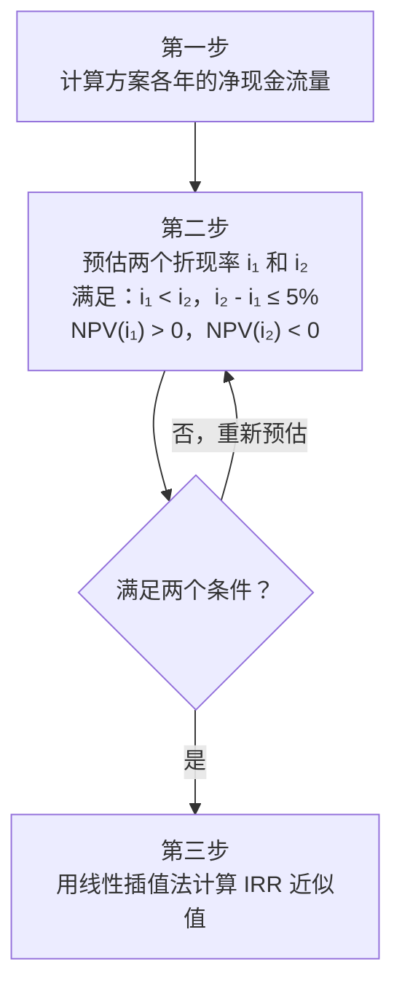

# 一、名词解释

> [!info] 整理说明 原文存在编号混乱、重复词条等问题，以下已按类别重新归并整理，合并同义词条并补全内容。

## 基础概念类

**1. 资金时间价值** 资金随时间推移而增值，其增值的这部分资金就是原有资金的时间价值。具体而言，将资金投入生产或流通领域，由于资金运动（流通→生产→流通）可得到一定收益或利润，即资金增了值；这段时间内产生的增值，就是资金的时间价值。**利息和盈利**是资金时间价值的两种表现形式。

**2. 现金流量图** 一种反映经济系统资金运动状态的图式，是描述现金流量作为时间函数的图形，能表示资金在不同时间流入与流出的情况。

**3. 等值计算** 不同时期、不同数额但其"价值等效"的资金计算。

**4. 名义利率** 计息周期利率乘以一个利率周期内的计息周期数所得的年利率（或周期利率）。

**5. 终值** 某计算期末资金的本利和。

**6. 净现值（NPV）** 按设定折现率（一般采用基准收益率）计算的项目计算期内净现金流量的现值之和，是反映投资方案在计算期内获利能力的动态评价指标。

**7. 盈亏平衡点** 指一个项目盈利和亏损之间的转折点。

## 评价与分析类

**8. 不确定性分析** 考查各种因素变化时，对项目经济评价指标影响的分析方法。

**9. 敏感性分析** 研究项目的投资、成本、价格、产量和工期等主要变量发生变化时，项目效益主要指标发生变动的敏感程度的分析方法。

**10. 风险分析（概率分析）** 对预期目标而言，经济主体遭受损失的不确定性分析；利用概率研究和预测不确定性因素对项目经济评价指标影响的定量分析方法。

**11. 项目后评价** 对项目在建成投产并达到设计生产能力后所进行的评价。

## 成本与价格类

**12. 资金成本** 投资者在工程项目实施中，为筹集和使用资金而付出的代价。

**13. 影子价格** 能够反映投入物和产出物真实经济价值、使资源得到合理配置的价格；即资源处于最优配置状态时的边际产出价值。项目**投入物**的影子价格为其**机会成本**，项目**产出物**的影子价格为其**支付意愿**。

**14. 沉没成本** 旧设备折旧后的账面价值与当前市场价值的差值（已发生且不可回收的成本）。

**15. 机会成本** 把一种具有多种用途的稀缺资源用于某一特定用途时，所放弃的其他用途中最佳用途的收益。

**16. 寿命周期成本** 被研究对象在经济寿命期间所发生的各项成本费用之和。

## 设备与工程类

**17. 经济寿命** 设备以全新状态投入使用开始，到因继续使用不经济而提前更新所经历的时间，即一台设备从投入使用开始到其年度费用最低的适用年限。

**18. 价值工程** 以最低的寿命周期成本，可靠地实现研究对象的必要功能，从而提高对象价值的系统化方法。

**19. 工程项目投资** 某项工程从筹建开始到全部竣工投产为止所发生的全部资金投入。

## 融资类

**20. 项目融资** 以项目的资产、收益作抵押的融资方式。

**21. 资金周转率法** 从资金周转的定义出发，推算出建设投资的一种估算方法。

---

# 二、简答题

## （一）基础理论

### Q1. 工程经济学的概念是什么？

工程经济学也称为**技术经济学**，是介于自然科学和社会科学之间的边缘学科。它根据现代科学技术和社会经济发展的需要，在两门学科相互渗透、相互促进的过程中逐渐形成，是工程技术学科和经济学科交叉的边缘学科。

### Q2. 工程经济学的基本原理有哪些？

1. 目的是提高经济效益；
2. 技术与经济之间是对立统一关系；
3. 重点是科学地预见活动的结果；
4. 对经济活动进行系统评价；
5. 满足可比条件是技术方案比较的前提。

### Q3. 工程经济学的特点有哪些？

立体性、实用性、定量性、比较性、预测性。

### Q4. 如何理解资金的时间价值？其主要影响因素有哪些？

资金的时间价值是指资金的价值随时间变化而变化，是时间的函数，随时间推移而发生价值增加，增加的那部分价值就是原有资金的时间价值。

**主要影响因素：**

- 资金的使用时间；
- 资金数量大小；
- 投入和回收的特点；
- 资金的周转速度。

### Q5. 资金的时间价值对技术方案经济评价有何影响？

资金的时间价值是客观存在的。技术方案在不同时期所投入的费用及产出的效益，其价值是不同的。因此，对技术方案进行经济效益评价时，必须对各方案的收益与费用进行**等值计算**，使其具有可比性，这是技术方案经济评价的重要前提条件。

---

## （二）现金流量

### Q6. 何谓现金流量？一般用什么表示？

**现金流量**是指拟建项目在整个项目计算期内各个时点上实际发生的现金流入、流出，以及流入与流出的差额（又称**净现金流量**）。通常用**现金流量图**或**现金流量表**来表示。

### Q7. 何谓现金流量图？包括哪三大要素？各代表什么？

**现金流量图**是描述现金流量作为时间函数的图形，能表示资金在不同时间流入与流出的情况。

|要素|含义|
|---|---|
|**大小**|资金数额|
|**流向**|现金流入（箭头向上）或流出（箭头向下）|
|**时间点**|现金流入或流出发生的时间|

### Q8. 简要说明现金流量图的绘制步骤。

1. 画出**时间轴**，标明计息期（每一刻度表示一个计息期）；
2. 标出**现金流量**（箭头向上为流入，向下为流出，箭线长度与金额成比例）；
3. 标示**利率**。

### Q9. 何谓现金流量表？纵列和横行各是什么？

**现金流量表**是能够直接、清楚地反映出项目在整个计算期内各年现金流量情况的一种表格，可用于计算各项静态和动态评价指标，是评价项目投资方案经济效果的主要依据。

- **纵列**：现金流量的项目，按现金流入、现金流出、净现金流量的顺序编排；
- **横行**：年份，按项目计算期的各阶段排列。

---

## （三）评价指标

### Q10. 常用的动态评价指标有哪些？

1. 内部收益率（IRR）；
2. 净现值（NPV）；
3. 净现值率（NPVR）；
4. 净年值（NAV）；
5. 动态投资回收期。

### Q11. 何谓净现值？何谓净现值率？二者的评价准则是什么？

**净现值（NPV）**：按设定折现率（一般采用基准收益率）计算的项目计算期内净现金流量的现值之和。

**净现值率（NPVR）**：项目净现值与项目全部投资现值之比。

> [!note] 评价准则
> 
> - **单方案**：$NPV \geq 0$ 可行；$NPV < 0$ 不可行。
> - **多方案**：先淘汰 $NPVR < 0$ 的方案，余下方案结合投资额与净现值综合选择。

### Q12. 试分析 NPV > 0、NPV = 0 和 NPV < 0 的经济意义。

|情形|经济含义|结论|
|---|---|---|
|$NPV > 0$|内部收益率**大于**基准收益率，投资能获得超额收益|方案**可取**|
|$NPV = 0$|内部收益率**等于**基准收益率，恰好达到基准收益水平|方案经济上**合理**，一般可取|
|$NPV < 0$|内部收益率**小于**基准收益率，达不到基准收益水平|方案经济上**不合理**，一般不可取|

### Q13. 净现值法的优缺点各有哪些？

**优点：**

1. 考虑了整个经济寿命期内的现金流量，反映纳税后的净收益；
2. 既能作单一方案的费用效益比较，又能进行多方案优劣比较。

**缺点：**

1. 基准折现率的确定较为困难；
2. 未考虑投资额大小（即资金利用效率），不利于规模不等方案的直接比较；
3. 不能对寿命期不同的方案直接比较（不满足时间可比性）。

### Q14. 简述分析建设项目盈利能力的指标。

投资回收期、财务内部收益率、财务净现值、财务净年值、投资利润率、投资利税率、资本金利润率。

### Q15. 说明经济评价三个基本指标及其相互关系与特点。

经济评价基本指标为**净现值、内部收益率、投资回收期**，三者对同一方案的评价结论一致，但各有侧重，无法相互替代。

**内部收益率（IRR）**：相对效果指标，反映方案未收回投资的收益率及可承担的最大资金成本；全面考虑整个寿命周期的现金流量，能直接反映单位投资效率。但现金流量非常规时不宜采用，也不能直接用于投资规模不等的方案比较。

**净现值（NPV）**：绝对效果指标，以货币额直接反映项目超额净收益，考虑资金时间价值，经济意义明确，是可靠适用的指标。但须预先确定基准收益率，且无法反映单位投资效率。

**投资回收期**：静态法反映回收速度与投资风险；动态法的经济特征可由 NPV 和静态投资回收期替代，更适用于方案初步评估或技术更新周期快的项目。

### Q16. 静态评价方法的优缺点分别是什么？

**优点：** 简便、直观，主要适用于方案的粗略评价；静态投资回收期和投资收益率为绝对指标，可对单一方案独立评价。

**缺点：**

1. 不能直观反映项目的总体盈利能力；
2. 未考虑方案在经济寿命期内费用、收益的变化，以及各方案寿命差异的影响；
3. 没有引入资金的时间因素，项目运行时间较长时不宜使用。

### Q17. 简述静态投资回收期的优缺点。

**优点：**

1. 概念清晰，直观性强，计算简单；
2. 能在一定程度上反映项目的经济性，同时反映项目的风险大小。

**缺点：**

1. 没有反映资金的时间价值；
2. 不能全面反映项目在全寿命周期内的经济效益。

### Q18. 影响基准收益率的因素有哪些？

基准收益率的确定一般以**行业平均收益率**为基础，同时综合考虑：资金成本、投资风险、通货膨胀、资金限制。

### Q19. 求内部收益率（IRR）的步骤有哪些？

$$IRR \approx i_1 + \frac{NPV(i_1)}{NPV(i_1) - NPV(i_2)} \times (i_2 - i_1)$$

---

## （四）不确定性分析

### Q20. 敏感性分析的基本步骤是什么？

1. 确定敏感性分析指标（如 NPV、IRR 等）；
2. 选定不确定性因素并设定其变动范围；
3. 进行分析计算，求出各因素变动时的指标变动值；
4. 计算敏感度系数，找出敏感性因素并排序；
5. 计算变动因素的临界点，综合分析并采取对策。

---

## （五）方案比选

### Q21. 简述多方案比较的基础（可比性原则）。

多方案比选时应考虑以下可比性：

1. **资料和数据的可比性**：各方案数据收集整理方法统一，等额标准、价格水平、计算范围与方法一致；
2. **功能的可比性**：各方案预期目标一致，产出功能相同；
3. **时间的可比性**：各方案应具有相同的寿命期；若不同，须按一定方法调整使其可比。

### Q22. "环比法"（逐步比较法）的步骤有哪些？

1. 将各可行方案按**投资额从小到大**排列，编号 Ⅰ、Ⅱ、Ⅲ……并增设 **0 方案**（不投资方案，投资与净收益均为 0）；
2. 比较 0 方案与Ⅰ方案，选出较好方案；
3. 用较好方案与Ⅱ方案比较，再选出较好方案；
4. 如此依次比较，逐步淘汰，**最后选出的方案即为最优方案**。

> [!note] 设置 0 方案的意义 避免从一组互斥方案中选出一个经济上并不可行的方案作为"最优方案"。

### Q23. 何谓单方案？单方案评价的作用是什么？

**单方案**：投资项目只有一个方案的情形。

**单方案评价的作用**：考察项目计算期内的现金流量情况，通过一系列评价指标进行综合论证，判断项目的经济合理性，为项目的取舍提供依据。

---

## （六）设备管理

### Q24. 设备磨损分为哪两大类？二者的联系与区别是什么？

|有形磨损|无形磨损|
|---|---|---|
|**联系**|均引起设备原始价值降低|均引起设备原始价值降低|
|**区别**|严重时设备通常无法正常工作（须大修）|不影响设备继续正常使用|

### Q25. 什么是设备的经济寿命？设备无形磨损有哪两种形式？

**经济寿命**：设备从投入使用开始，到因继续使用经济上不合理而被更新所经历的时间（即年度费用最低的适用年限）。

**无形磨损的两种形式：**

- **第Ⅰ类无形磨损**：由于制造同类设备的劳动生产率提高，生产同类型、同功能设备所需社会必要劳动时间减少，导致原有设备贬值；
- **第Ⅱ类无形磨损**：由于出现性能更完善、生产效率更高的新设备，使原有设备相对贬值。

---

## （七）项目建设与融资

### Q26. 构成建设项目的主要条件和特点是什么？

1. 按照一个总体设计进行建设，行政上统一管理，经济上统一核算；
2. 建设目标和任务明确；
3. 一般具有建筑工程和设备安装等有形资产，部分项目还有无形资产；
4. 过程的**一次性**和成果的**单件性**；
5. 建设过程遵循客观规律，按照一定程序进行。

### Q27. 从建设项目管理角度阐述建设程序主要包括哪几个阶段？

### Q28. 简述可行性研究的意义及阶段划分。

**意义：**

- 为投资者的科学决策提供依据；
- 为银行贷款、合作者签约、工程设计等提供依据和基础资料。

**阶段划分：** 机会研究 → 初步可行性研究 → 详细可行性研究。

### Q29. 国内债务融资有哪些渠道？

1. 国家政策性银行；
2. 国有商业银行；
3. 股份制商业银行；
4. 非银行金融机构；
5. 在国内发行债券；
6. 国内融资租赁。

### Q30. 项目融资包括哪几个阶段？

1. 投资决策分析；
2. 融资决策分析；
3. 融资结构分析；
4. 融资谈判；
5. 项目融资的执行。

### Q31. 影响资金结构的因素主要有哪些？

1. 项目建设者的风险意识及所有权结构；
2. 企业的规模；
3. 资产结构；
4. 利率水平的变动趋势；
5. 企业的财务状况。

---

## （八）国民经济评价

### Q32. 简述建设项目财务评价与国民经济评价的区别。

|比较维度|财务评价|国民经济评价|
|---|---|---|
|**评价角度**|企业（微观）|国家/社会（宏观）|
|**费用与效益含义**|企业实际发生的财务收支|对国民经济的真实代价与贡献|
|**价格体系**|现行市场价格|影子价格|
|**使用参数**|财务参数（基准收益率等）|社会折现率等经济参数|
|**评价内容**|财务生存能力、盈利能力|经济净效益、资源配置效率|
|**不确定性分析**|敏感性分析为主|方法和范围有所不同|

### Q33. 简述国民经济评价中费用与效益计算的原则。

1. **机会成本原则**；
2. **有无原则**（有无项目的对比）；
3. **边际原则**；
4. **国家原则**（以国家整体利益为出发点）。

---

## （九）销售税金与财务指标

### Q34. 销售税金包括哪些税种？

增值税、消费税、营业税、城乡维护建设税、资源税。

### Q35. 财务报表分析中的主要比率指标

- **资产负债比率**：负债总额 ÷ **资产总额**
- **流动比率**：流动资产 ÷ **流动负债**