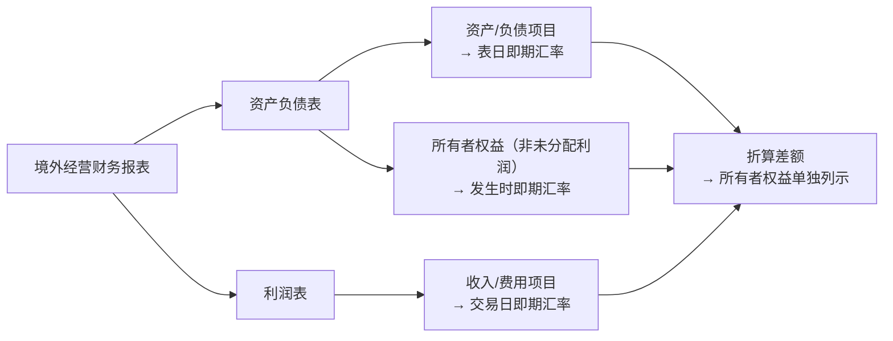
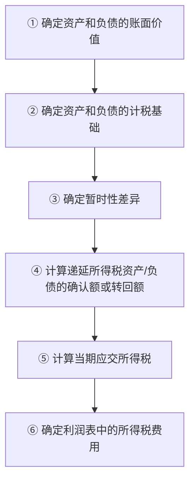
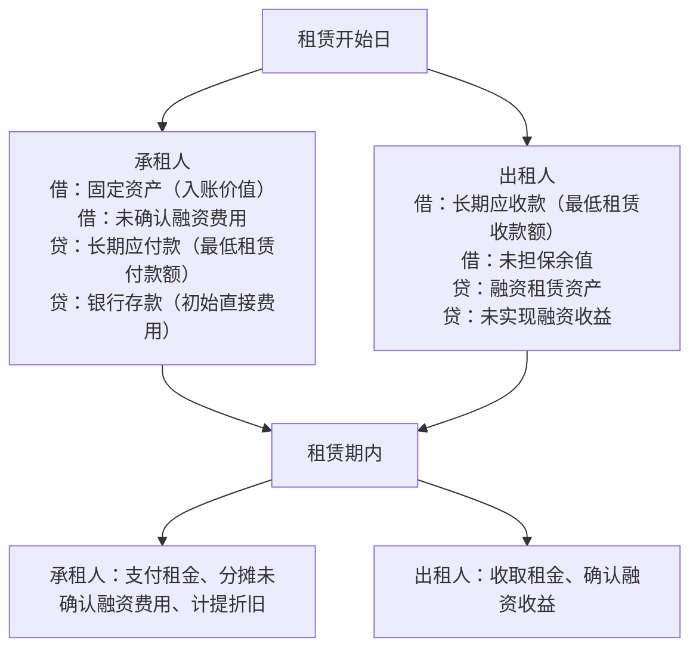
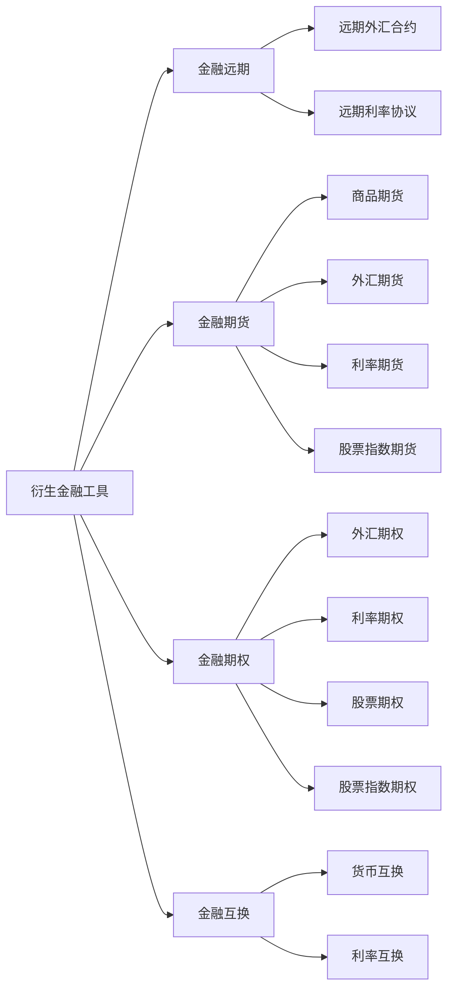
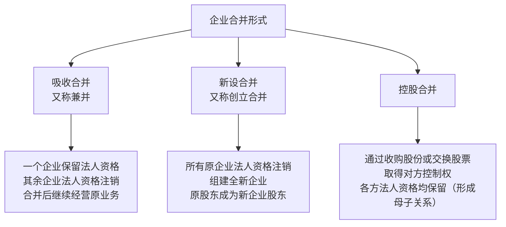
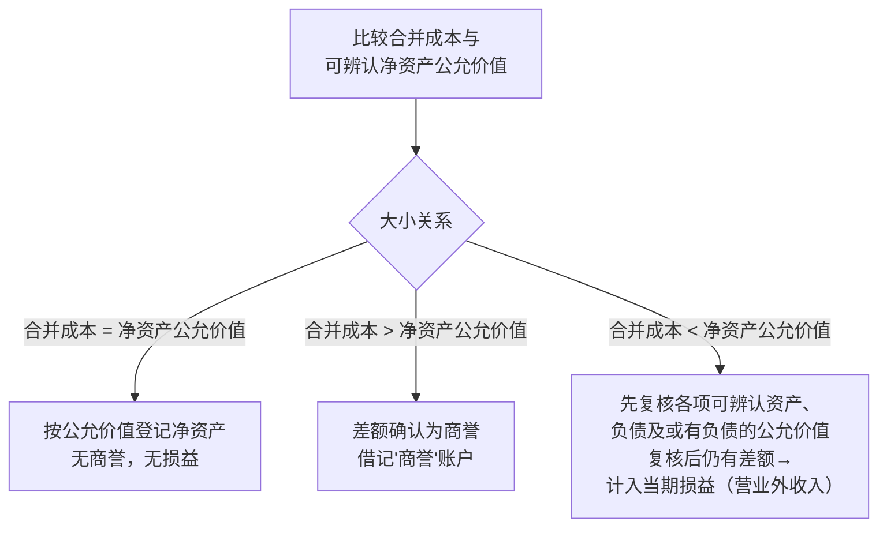

# 第一章 外币会计

## 一、外币会计概述

> [!info] 基本概念辨析
> 
> - **外币**：本国货币以外的其他国家或地区的货币。
> - **外汇**：外币资产的总称，范围更广，**外汇包括外币**。
> - **记账本位币**：企业经营所处的主要经济环境中的货币；非记账本位币即为会计核算意义上的外币。

**外币业务**包括两类：**外币交易**和**外币报表折算**。外币交易是指企业以非记账本位币进行收付、结算等业务。

> [!note] 汇率定义 **汇率**（又称"汇价"或"外汇牌价"）：一国货币兑换另一国货币的比率，是不同货币之间兑换的依据和标准。

### 汇率标价方法

|标价方法|定义|特点|
|---|---|---|
|**直接标价法**|以一定单位外币为标准，折合成一定数额本国货币|外币数额固定，本币数额随汇率变动；本币币值与汇率**成反比**|
|**间接标价法**|以一定单位本国货币为标准，折合成一定数额外币|与直接标价法相反；英、美通常采用（美国对英镑除外）|

### 汇兑损益的类型

> [!summary] 汇兑损益分类 汇兑损益是指企业外币业务折算为记账本位币时，因汇率变动产生的折算差额及兑换收付差额，对企业带来的收益或损失，又称"汇兑差额"。
> 
> |类型|性质|
> |---|---|
> |① 交易汇兑损益|日常交易损益|
> |② 兑换汇兑损益|日常交易损益|
> |③ 调整外币汇兑损益|期末调整损益|
> |④ 外币折算汇兑损益|期末折算损益|

---

## 二、外币交易会计

### 交易观点比较

|观点|核心理念|年终汇兑损益处理|
|---|---|---|
|**单一交易观点**|外币购销与后续结算视为**同一笔交易**的两个阶段；最终成本/收入取决于结算日汇率|**不确认**未实现汇兑损益|
|**两项交易观点**|购销业务与账款结算视为**两笔独立交易**；成本/收入取决于交易日汇率|**确认**汇兑损益（我国准则采用此法）|

### 折算汇率的选择

> [!tip] 折算汇率规则
> 
> - **即期汇率**：通常为当日中国人民银行公布的人民币外汇牌价**中间价**，为首选。
> - **即期近似汇率**：按系统合理方法确定，如当期平均汇率或加权平均汇率，汇率波动不大时可采用，但**前后各期应保持方法一致**。

### 外币交易日账务处理要点

1. **收到外币投资**：按交易日即期汇率折算，确认"实收资本"；外币投入资本与货币性项目间**不产生**折算差额。
2. **收到外币筹资**："银行存款"及借款类负债账户均按交易日即期汇率折算。
3. **结汇业务**（企业卖出外汇给银行）：
    - 借：银行存款（实收人民币金额）
    - 贷：相关外币账户（按即期汇率折算人民币）
    - 差额：财务费用——汇兑差额
4. **售汇业务**（企业向银行购买外汇）：实际支付人民币与购入外汇折算人民币之间的差额计入**汇兑损益**。
5. **外币兑换业务**：以实际采用的汇率（银行买入价或卖出价）进行折算。

---

## 三、外币财务报表的折算

> [!important] 境外经营财务报表折算原则
> 
> 1. **资产负债表**：资产和负债项目采用**资产负债表日即期汇率**折算；所有者权益项目（除"未分配利润"外）采用**发生时即期汇率**折算。
> 2. **利润表**：收入和费用项目采用**交易发生日即期汇率**（或近似汇率）折算。
> 3. **折算差额**：在资产负债表所有者权益项目下**单独列示**。
> 4. **比较报表**：比照上述原则处理。

---

# 第二章 所得税会计

## 一、所得税会计概述

### 所得税会计的发展阶段

所得税会计属于财务会计的分支，其发展经历了三个阶段：

1. **合并阶段**：所得税会计与财务会计合二为一，共同发展；
2. **分离阶段**：所得税会计与财务会计逐步分离（主要原因：税法与会计在**目标、依据及核算基础**上存在根本差异）；
3. **独立发展阶段**：所得税会计独立产生并发展。

### 资产负债表债务法的意义

> [!note] 资产负债表债务法 资产负债表债务法基于**资产负债观**，其意义体现在：
> 
> - 按资产负债观确认的收益兼顾**交易因素**和**非交易因素**，比收入费用观更全面，对使用者更有用；
> - 有助于信息使用者评价报告日财务状况和未来现金流量，提升**预测价值**；
> - 在所得税核算中贯彻了资产、负债的界定，确认和计量已发生交易对未来所得税流入或流出的影响。

### 所得税会计核算程序

---

## 二、资产与负债的计税基础

### 计税基础公式

> [!note] 计税基础定义与公式 **资产的计税基础**：企业在收回资产账面价值过程中，按税法规定可自应税经济利益中抵扣的金额。
> 
> $$\text{资产的计税基础} = \text{未来可税前列支的金额}$$
> 
> **负债的计税基础**：负债账面价值减去未来期间按税法规定可予抵扣的金额。
> 
> $$\text{负债的计税基础} = \text{负债的账面价值} - \text{未来可税前扣除的金额}$$

### 暂时性差异类型

|暂时性差异类型|产生情况|对应处理|
|---|---|---|
|**可抵扣暂时性差异**|资产账面价值 < 计税基础；或负债账面价值 > 计税基础|确认递延所得税**资产**|
|**应纳税暂时性差异**|资产账面价值 > 计税基础；或负债账面价值 < 计税基础|确认递延所得税**负债**|

> [!tip] 资产减值准备产生的暂时性差异 资产计提减值准备后，账面价值下降，但**计税基础不随减值准备变化**，故产生账面价值与计税基础之间的暂时性差异。税法规定资产发生**实质性损失**时才允许税前扣除。

### 特殊项目的暂时性差异

**预收账款的处理：**

- 一般情况：预收账款会计不确认收入，税法也不计入纳税所得 → **不产生**暂时性差异。
- 特殊情况：会计不确认收入，但税法规定应计入当期纳税所得 → 产生**可抵扣**暂时性差异。

**其他特殊项目：**

- 筹建费用等不符合资产、负债确认条件但有税法计税基础的项目，其账面价值（0）与计税基础之间的差异也构成暂时性差异。
- 可抵扣亏损和税款抵减：视同**可抵扣暂时性差异**处理（我国采用亏损后转结方法）。

---

## 三、递延所得税资产和递延所得税负债的核算

### 不确认递延所得税资产的特殊情况

> [!warning] 以下情形不确认递延所得税资产
> 
> 1. 非企业合并交易，发生时既不影响会计利润也不影响应纳税所得额，且资产、负债初始确认额与计税基础不同所产生的可抵扣暂时性差异；
> 2. 与子公司、联营企业及合营企业投资相关的、不同时满足两个条件的可抵扣暂时性差异；
> 3. 资产负债表日预计未来期间**很可能无法**获得足够的应纳税所得额用以利用可抵扣亏损和税款抵减时。

**账务处理（确认时）：**

- 借：递延所得税资产
- 贷：所得税费用——递延所得税费用 / 资本公积——其他资本公积 / 商誉

### 不确认递延所得税负债的特殊情况

> [!warning] 以下情形不确认递延所得税负债
> 
> 1. **商誉的初始确认**：非同一控制下企业合并中，合并成本大于被购买方可辨认净资产公允价值份额的差额确认的商誉；
> 2. 非企业合并交易中，发生时既不影响会计利润也不影响应纳税所得额的交易事项；
> 3. 与子公司、联营企业及合营企业投资相关的、在投资企业能够控制转回时间且预见未来**很可能不会转回**时。

**账务处理（确认时）：**

- 借：所得税费用——递延所得税费用 / 资本公积——其他资本公积 / 商誉
- 贷：递延所得税负债

---

## 四、所得税费用的核算

### 核心公式

> [!note] 所得税费用计算
> 
> $$\text{当期所得税} = \text{当期应纳税所得额} \times \text{适用所得税税率}$$
> 
> $$\text{应纳税所得额} = \text{会计利润} \pm \text{各类税会差异调整项}$$
> 
> $$\text{递延所得税} = (\text{期末递延所得税负债} - \text{期初递延所得税负债}) - (\text{期末递延所得税资产} - \text{期初递延所得税资产})$$
> 
> $$\boxed{\text{所得税费用} = \text{当期所得税} + \text{递延所得税}}$$

> [!tip] 应纳税所得额调整项说明 调整因素除暂时性差异外，还包括**非暂时性差异**，例如：
> 
> - 罚款、税收滞纳金；
> - 非公益性捐赠和赞助；
> - 超过当年利润总额 12% 的公益性捐赠部分。

> [!caution] 注意事项 计算递延所得税时，"递延所得税资产"和"递延所得税负债"账户余额，应**扣除**直接计入所有者权益、商誉以及营业外收入部分后的金额。

---

# 第三章 上市公司会计信息的披露

## 一、上市公司信息披露概述

|披露文件类型|定义与说明|
|---|---|
|**招股说明书**|股份有限公司公开发行股票时，按规定向社会公众披露公司信息的书面报告|
|**上市公告书**|股票获准在证券交易所交易后，管理当局向社会公众披露股票上市情况的书面报告|
|**定期报告**|包括年度报告、中期报告和季度报告；**年度财务报告必须经注册会计师审计**|
|**临时报告**|包括重大事件公告和公司收购公告；重大事件公告须在投资者尚未知悉时立即披露|

---

## 二、分部报告

> [!note] 核心概念 **分部报告**：对跨行业、跨地区经营的企业，按确定的内部组成部分（业务分部或地区分部）编报的有关各组成部分收入、费用、利润、资产、负债等信息的财务报告。

**分部报告类型：**

1. **业务分部报告**：按经营业务的不同性质编制；
2. **地区分部报告**：按经营业务的地域范围编制。

**判断分部的核心依据**：是否承担了**不同于其他组成部分的风险和报酬**。

### 分部收入与费用

**分部收入**：可归属于分部的对外交易收入 + 对其他分部的交易收入。通常**不包括**：以企业整体为基础管理的投融资收入及非营业活动收入。

**分部费用**：可归属于分部的对外交易费用 + 对其他分部的交易费用。通常**不包括**以下项目：利息费用、权益法核算的长期股权投资净损失应承担份额、处置投资发生的净损失、营业外支出、所得税费用，以及与企业整体相关的管理费用和其他费用。

---

## 三、中期财务报告

> [!info] 基本定义 **中期财务报告**：以中期（短于一个完整会计年度的报告期间）为基础编制的财务报告。 **最低应包含**：资产负债表、利润表、现金流量表和附注。

**特殊质量要求**：编制时需特别考虑**重要性**和**及时性**两个质量要求。重要性判断以**中期财务数据**为依据（含本中期数据及年初至本中期末的累计数据）。

### 比较财务报表要求

|报表类型|提供内容|
|---|---|
|**资产负债表**|本中期末 + 上年度末|
|**利润表**|本中期 + 年初至本中期末 + 上年度可比期间（含同期及累计）|
|**现金流量表**|年初至本中期末 + 上年度年初至可比本中期末|

**附注披露要求：**

1. 应以年初至本中期为基础披露；
2. 应披露自上年度资产负债表日后发生的重要交易或事项。

---

## 四、关联方披露

> [!note] 关联方定义 若一方有能力**控制、共同控制**另一方或对另一方施加**重大影响**，则存在关联方关系；若两方或多方同受一方控制、共同控制或重大影响，亦构成关联方关系。关联方关系包括纵向和横向两种，均有控制、共同控制和重大影响三种影响形式。

### 关联方存在的主要形式（10类）

1. 该企业的**母公司**；
2. 该企业的**子公司**；
3. 与该企业受同一母公司控制的**其他企业**；
4. 对该企业实施**共同控制**的投资方；
5. 对该企业施加**重大影响**的投资方；
6. 该企业的**合营企业**；
7. 该企业的**联营企业**；
8. 该企业的**主要投资者个人**及与其关系密切的家庭成员（主要投资者个人：能够控制、共同控制或对企业施加重大影响的个人投资者）；
9. 该企业或其母公司的**关键管理人员**及与其关系密切的家庭成员（包括董事长、董事、总经理、财务总监等，**不包括监事**）；
10. 上述第8、9类人员所控制、共同控制或施加重大影响的**其他企业**。

### 不构成关联方的情况

> [!warning] 以下三类情况不构成关联方
> 
> 1. 与企业发生日常往来的资金提供者、公用事业部门、政府部门及机构，以及因大量交易而存在经济依存关系的单个客户、供应商、特许商、经销商或代理商；
> 2. 与该企业**共同控制合营企业的合营者**（仅因共同控制合营企业而不构成关联方，无其他关联关系时）；
> 3. **仅同受国家控制**而不存在其他关联方关系的企业。

### 必须披露的控制关系信息

无论是否发生关联方交易，企业均应在附注中披露与其存在**控制关系**的母公司和子公司的以下信息：

1. 母公司和子公司的名称（若母公司非最终控制方，还需披露最终控制方名称；若均不对外提供报表，则披露最相近的对外提供财务报表的母公司名称）；
2. 母公司和子公司的业务性质、注册地、注册资本（或实收资本、股本）及其变化；
3. 母公司对子公司（或子公司对母公司）的**持股比例和表决权比例**。

---

# 第四章 租赁会计

## 一、租赁会计概述

> [!info] 基本概念
> 
> - **租赁会计**：运用会计学理论和方法，以货币为计量单位，对企业租赁活动进行综合、全面、连续、系统地反映、监督和管理。
> - **租赁分类**：按租赁目的不同，分为**经营租赁**和**融资租赁**。

> [!note] 担保余值
> 
> - **对承租方**：由承租人或与其有关的第三方担保的资产余值；
> - **对出租方**：承租方所担保的资产余值。

---

## 二、经营租赁业务会计

**初始直接费用**：承租人在租赁谈判和签订合同过程中发生的、可归属于租赁项目的手续费、律师费、差旅费、印花税等，**确认为当期费用**。

**折旧政策**：经营租赁的固定资产采用**类似资产的折旧政策**计提折旧；其他经营租赁资产采用**系统合理的方法**进行摊销。

**承租人账务处理：**

|事项|借方|贷方|
|---|---|---|
|支付租金|租赁费用（管理费用/制造费用等）|银行存款|
|发生初始直接费用|当期费用|银行存款|
|出租方计提折旧|折旧费用|累计折旧|

---

## 三、融资租赁的会计处理

### 融资租赁的认定标准

> [!important] 满足下列条件之一即认定为融资租赁
> 
> 1. **所有权转移标准**：租赁期届满时，租赁资产所有权转移给承租人；
> 2. **留购价标准**：承租人有购买选择权，购价预计远低于行使时公允价值（≤5%）；
> 3. **租期标准**：租赁期占租赁资产尚可使用年限的大部分（≥75%）；
> 4. **价值补偿标准**：租赁开始日，最低租赁付款额（或收款额）的现值几乎相当于租赁资产公允价值（≥90%）。

### 核心计算公式

> [!note] 融资租赁关键公式
> 
> $$\text{最低租赁付款额} = \sum\text{各期租金} + \text{租赁期满担保余值（或优惠购买价款）} + \text{其他款项}$$
> 
> $$\text{最低租赁付款额现值} = \text{租金} \times \text{年金现值系数} + \text{担保余值} \times \text{复利现值系数}$$

> [!note] 租赁内含利率 在租赁开始日，使**最低租赁付款额现值 + 未担保余值现值 = 租赁资产公允价值 + 出租人初始直接费用**的折现率。

### 融资租赁账务处理要点

---

## 四、售后租回业务会计

> [!note] 售后租回定义 企业将自制或外购资产**出售**后，再向买方**租回**使用的方式。

### 差额处理规则

|租回类型|售价与账面价值差额的处理|例外情形|
|---|---|---|
|**融资租赁性质**|予以**递延**，按租赁资产折旧进度分摊，作为**折旧费用的调整**|无|
|**经营租赁性质**|予以**递延**，在租赁期内按与确认租金费用一致的方法分摊，作为**租金费用的调整**|有确凿证据表明交易按**公允价值**达成的，差额**直接计入当期损益**|

---

# 第五章 衍生金融工具会计

## 一、金融工具会计概述

> [!info] 核心概念
> 
> - **金融工具**：包括企业的金融资产、金融负债和权益工具，是完成货币流通和银行信用的重要手段。
> - **权益工具**：能证明持有方拥有企业扣除所有负债后资产中剩余权益的合同（如普通股、认股权等）。
> - **衍生金融工具**：价值随特定因素变动而变动、不要求或仅需极少初始净投资、在未来某一时期结算的金融工具。

### 衍生金融工具的种类

---

## 二、衍生金融工具一般业务的核算

> [!tip] 交易费用处理 企业取得衍生金融工具发生的相关**交易费用**应直接计入**当期损益**。
> 
> **交易费用**（新增外部费用）包括：支付给代理机构、咨询公司、券商等的手续费和佣金及其他必要支出。
> 
> **不包括**：债券溢价、折价、融资费用、内部管理成本及其他与交易不直接相关的费用。

**衍生金融工具账务处理框架：**

|时点|处理原则|
|---|---|
|取得时|按公允价值入账，交易费用计入当期损益|
|资产负债表日|按公允价值重新计量，变动计入当期损益（公允价值变动损益）|
|终止确认时|按处置价与账面价值之差计入当期损益|

> [!tip] 重点掌握内容 应分别掌握**远期合同业务**和**商品期货业务**的具体账务处理。

---

## 三、套期保值的核算

### 套期保值基本概念

> [!note] 套期保值定义 企业为规避**外汇风险、利率风险、商品价格风险、股票价格风险、信用风险**等，指定一项或多项衍生金融工具为套期工具，使其公允价值或现金流量变动，预期抵销被套期项目全部或部分公允价值或现金流量变动的行为。

### 套期类型比较

|套期类型|定义|被套期对象|
|---|---|---|
|**公允价值套期**|对已确认资产/负债或确定承诺的公允价值变动风险进行套期|已确认资产负债、确定承诺|
|**现金流量套期**|对现金流量变动风险进行套期（源于特定风险且影响损益）|已确认资产负债、很可能发生的预期交易|
|**境外经营净投资套期**|对境外经营净投资的外汇风险进行套期|境外经营净资产中的权益份额|

> [!tip] 特别注意 对确定承诺的外汇风险进行套期时，企业可选择作为**现金流量套期**或**公允价值套期**处理。

### 被套期项目的范围

1. 单项已确认资产、负债、确定承诺、很可能发生的预期交易，或境外经营净投资；
2. 一组具有**类似风险特征**的上述项目组合；
3. 分担同一被套期利率风险的金融资产或金融负债组合的一部分（仅适用于**利率风险公允价值组合套期**）。

### "套期工具"科目核算

**科目性质**：共同类科目，期末借方余额反映套期工具形成的**资产**公允价值，贷方余额反映套期工具形成的**负债**公允价值。

|情形|账务处理|
|---|---|
|将衍生金融工具指定为套期工具|借/贷：套期工具；贷/借：衍生金融工具|
|资产负债表日有效套期产生利得|借：套期工具；贷：套期损益|
|资产负债表日有效套期产生损失|借：套期损益；贷：套期工具|
|不再作为套期工具核算|借/贷：有关科目；贷/借：套期工具|

### 终止套期会计核算的条件

> [!warning] 公允价值套期——终止条件（满足之一即终止）
> 
> 1. 套期工具已到期、被出售、合同终止或已行使；
> 2. 该套期不再满足运用套期会计方法的条件；
> 3. 企业撤销了对套期关系的指定。

> [!warning] 现金流量套期——终止条件（满足之一即终止）
> 
> 4. 套期工具已到期、被出售、合同终止或已行使；
> 5. 该套期不再满足套期会计核算条件；
> 6. **预期交易预计不会发生**；
> 7. 企业撤销了对套期关系的指定。

### 境外经营净投资套期的账务处理

参照现金流量套期处理：

- **有效套期**部分的利得或损失：直接确认为**所有者权益**（单列项目）；处置境外经营时，转出计入**当期损益**。
- **无效套期**部分的利得或损失：直接计入**当期损益**。

---

## 四、衍生金融工具列报

### 金融资产与金融负债的抵销规则

金融资产和金融负债原则上应在资产负债表内**分别列示，不得相互抵销**。

> [!important] 可以净额列示的条件（须同时满足）
> 
> 1. 企业具有抵销已确认金额的**法定权利**，且该权利**现在可执行**；
> 2. 企业计划以**净额结算**，或同时变现该金融资产和清偿该金融负债。

> [!warning] 不能相互抵销的情形
> 
> 1. 将几项金融工具组合模拟某项金融资产或负债，组合内各单项工具形成的资产或负债不能相互抵销；
> 2. 作为某金融负债**担保物**的金融资产，不能与被担保的金融负债抵销；
> 3. 企业与外部交易对手进行多项金融工具交易，同时签订"总抵销协议"的情形。
> 
> 注：不满足终止确认条件的金融资产转移，转出方**不得**将已转移金融资产和相关负债进行抵销。

---

# 第六章 企业合并会计（一）——企业合并的账务处理

## 一、三种合并形式的区分

|合并形式|别称|法人资格变化|常见支付方式|
|---|---|---|---|
|**吸收合并**|兼并|一方保留，其余注销|现金购买 / 股票交换|
|**新设合并**|创立合并|所有参与方注销，新设企业|股票交换|
|**控股合并**|—|各方保留，形成母子关系|收购股份 / 股票交换|

---

## 二、同一控制下企业合并的账务处理

> [!important] 同一控制下合并的核心原则 合并方在合并日取得资产和负债的入账价值，应按照**被合并方的原账面价值**确认，不以公允价值计量。

### 1. 吸收合并

合并方可通过支付现金、转让非现金资产、承担债务或发行权益性证券方式实现吸收合并。

**账务处理要点：** 按被合并方**账面价值**确认取得的各项资产和负债；取得净资产账面价值与放弃对价账面价值的差额，及股份面值与净资产账面价值的差额，调整**资本公积**，不足时调整**留存收益**。

### 2. 新设合并

合并日取得资产和负债按**被合并方原账面价值**确认；取得净资产账面价值与所放弃净资产账面价值的差额，以及发行权益性证券确认的净资产账面价值与发行股份面值之间的差额，调整**资本公积和留存收益**。

### 3. 控股合并

合并方在合并日按**被合并方原账面价值**确认取得的资产和负债；差额处理同新设合并，调整**资本公积和留存收益**。

---

## 三、非同一控制下——一次交换交易实现企业合并的账务处理

### 合并成本的确定

> [!note] 合并成本的构成 合并成本 = 购买方在购买日付出的**资产、发生或承担的负债及发行权益性证券的公允价值**
> 
> 以下两类项目也应计入合并成本：
> 
> 1. 购买方为进行合并发生的**各项直接相关费用**；
> 2. 合并合同中约定的、估计很可能发生且金额能可靠计量的**或有对价**。
> 
> 注：购买方付出的资产和负债，应按**公允价值**计量，公允价值与账面价值的差额计入**当期损益**。

### 具体账务处理：三种情形

|情形|处理方式|
|---|---|
|合并成本 **=** 可辨认净资产公允价值|按公允价值登记净资产，无商誉|
|合并成本 **>** 可辨认净资产公允价值|差额确认为**商誉**，借记"商誉"账户|
|合并成本 **<** 可辨认净资产公允价值|先复核公允价值；复核后差额仍存在的，计入**当期损益**|