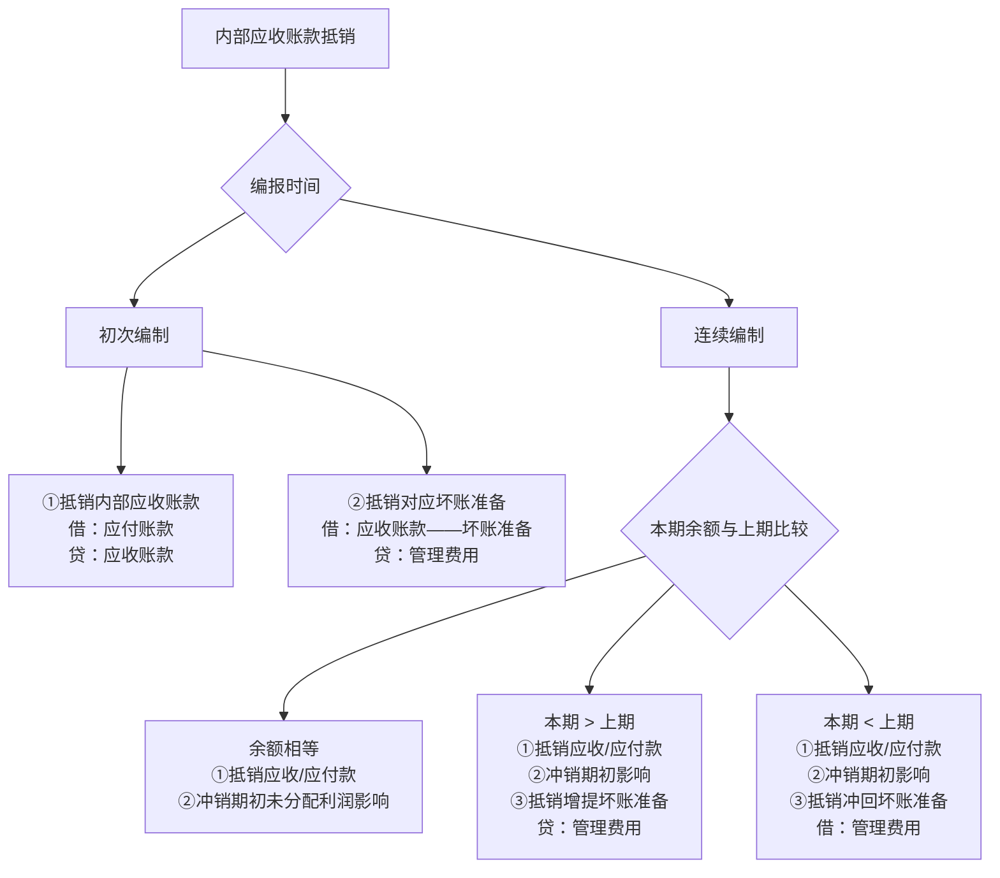
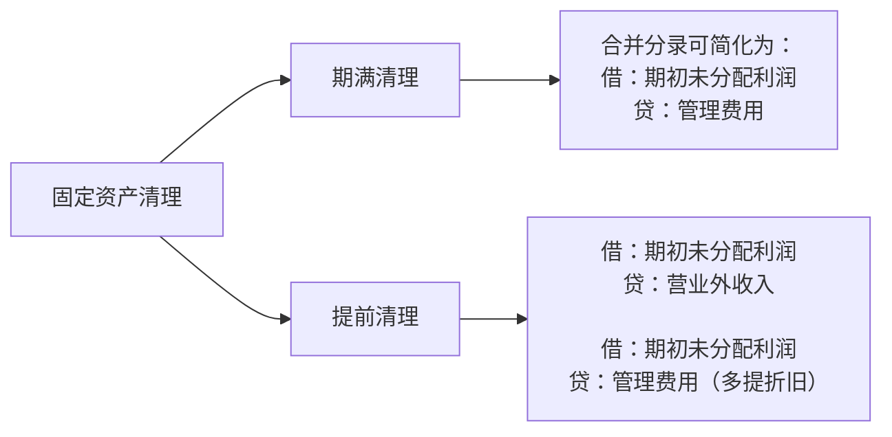
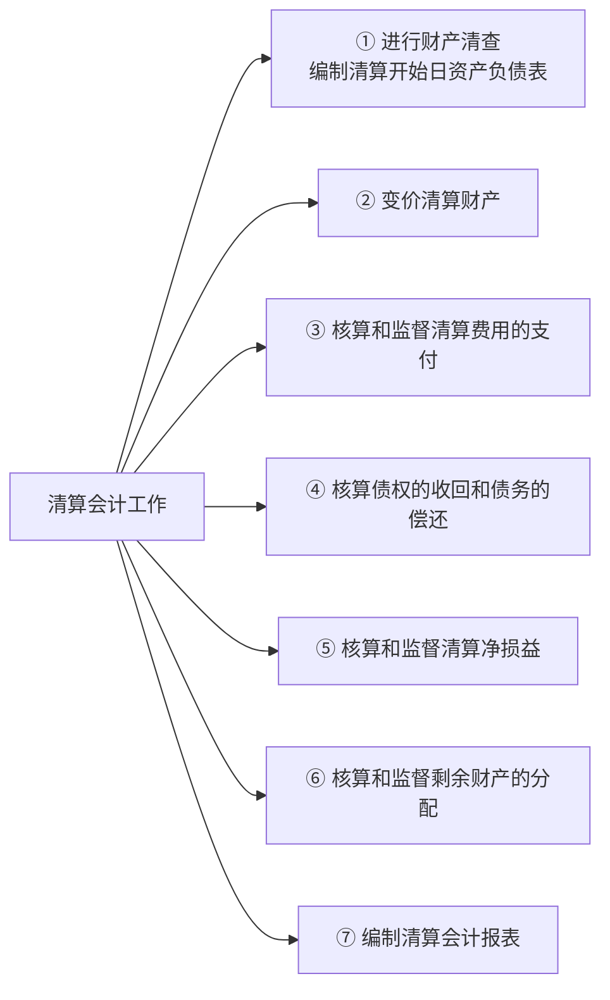
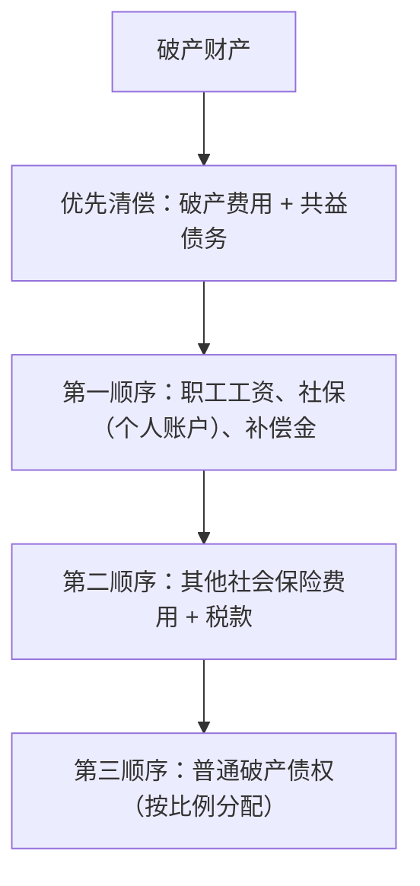

---

title: 高级财务会计复习资料（下） 
date: 2026-04-10 
updated: 2026-04-10 
slug: 高级财务会计复习资料-下 
excerpt: 本文系统整理高级财务会计下册核心考点，涵盖购并日合并财务报表、购并日后合并报表抵销处理、通货膨胀会计（一般物价水平会计与现时成本会计）及清算会计六大章节，适合期末复习与考研备考使用。 
tags:
- 财务会计
- 企业合并
- 合并报表
- 通货膨胀会计
- 清算会计
- 抵销分录
- 复习资料 
author: 徐尽欢 
status: published

---

# 第七章 企业合并会计（二）——购并日的合并财务报表

## 一、购买法下控制权取得日合并资产负债表的编制

### 1. 母公司拥有子公司全部股权的合并报表编制

母公司拥有子公司全部股权有两种情形：**投资组建全资子公司**和**购买子公司的全部股权**。

#### （1）投资组建全资子公司

母公司出资组建全资子公司，在控制权取得日编制合并报表时，将母公司"长期股权投资——子公司"与子公司全部股东权益相互抵销：

```
借：股本（子公司）
贷：长期股权投资——某子公司
```

#### （2）购买子公司全部股权

母公司购买正在持续经营的子公司全部股权，其支付的购买价（投资成本）可能**高于、低于或等于**子公司净资产账面价值，应采用不同方法编制合并财务报表。

> [!tip] 三种情形处理 与第六章非同一控制下合并的处理思路一致：
> 
> - 成本 = 净资产公允价值 → 无商誉；
> - 成本 > 净资产公允价值 → 差额确认为**商誉**；
> - 成本 < 净资产公允价值 → 复核后差额计入**当期损益**。

### 2. 母公司购买子公司部分股权的合并报表编制

由于母公司只拥有子公司部分股权，其余股权由其他股东（少数股东）持有，因此产生**少数股东权益**。

> [!note] 少数股东权益的列示 按照母公司理论，少数股东权益作为合并资产负债表的**负债项目**列示（单独列于负债类与所有者权益类之间）。

母公司按账面价值、高于或低于账面价值购买时，其合并财务报表的编制方法各有不同。

---

## 二、权益集合法下控制权取得日合并会计报表的编制

### 1. 母公司获得子公司全部股权

母公司通过发行和交换股票获得子公司全部股权，编制合并报表时，将母公司对子公司的投资与子公司全部股东权益予以抵销：

```
借：所有者权益项目（子公司账面价值）
贷：长期股权投资——子公司
```

### 2. 母公司获得子公司部分股权

母公司通过发行和交换股票获得子公司部分股权，编制合并报表时，将母公司对子公司的投资与子公司股东权益中属于母公司的部分抵销：

```
借：所有者权益项目（子公司账面价值 × 控股比例）
贷：长期股权投资——子公司
      少数股东权益
```

---

# 第八章 企业合并会计（三）——购并日后的合并财务报表

## 合并报表抵销分录的编制

### 一、集团内部权益性投资的抵销

#### （1）长期股权投资与子公司所有者权益的抵销

将母公司对子公司的长期股权投资与子公司所有者权益相互抵销：

```
借：实收资本（子公司）
    资本公积（子公司）
    盈余公积（子公司）
    未分配利润（子公司）
    商誉（如有）
贷：长期股权投资（母公司）
    少数股东权益（子公司所有者权益 × 少数股东持股比例）
```

> [!important] 注意 "少数股东权益"项目应在合并资产负债表中**负债类项目与所有者权益类项目之间单独列示**。

#### （2）投资收益与子公司利润分配相关项目的抵销

```
借：投资收益（子公司净利润 × 母公司持股比例）
    少数股东收益（子公司净利润 × 少数股东持股比例）
    期初未分配利润（子公司）
贷：提取盈余公积（子公司）
    对股东的分配（子公司）
    年末未分配利润（子公司）
```

> [!tip] 实务区分 具体处理时，应区分**全资子公司**和**非全资子公司**两种情况进行。

---

### 二、集团内部债权和债务项目的抵销

#### （1）内部应收账款与坏账准备的抵销



**初次编制时的抵销分录：**

```
①将内部应收账款与应付账款抵销：
借：应付账款
贷：应收账款

②将内部应收账款对应的坏账准备抵销：
借：应收账款——坏账准备
贷：管理费用
```

**连续编制——本期余额等于上期：**

```
借：应付账款
贷：应收账款

借：应收账款——坏账准备
贷：期初未分配利润
```

**连续编制——本期余额大于上期：**

```
借：应付账款
贷：应收账款

借：应收账款——坏账准备
贷：期初未分配利润

借：应收账款——坏账准备（增提部分）
贷：管理费用
```

**连续编制——本期余额小于上期：**

```
借：应付账款
贷：应收账款

借：应收账款——坏账准备
贷：期初未分配利润

借：管理费用（冲回部分）
贷：应收账款——坏账准备
```

#### （2）集团内部其他债权债务的抵销

|内部债权债务|抵销分录|
|---|---|
|预收/预付账款|借：预收账款 贷：预付账款|
|应付/应收票据|借：应付票据 贷：应收票据|
|应付/应收股利|借：应付股利 贷：应收股利|
|其他应付/应收款|借：其他应付款 贷：其他应收款|
|应付债券/长期债权投资|借：应付债券 贷：长期债权投资|

#### （3）内部利息收入与利息支出的抵销

```
借：投资收益
贷：财务费用（或在建工程）
借/贷：商誉（如有差额）
```

---

### 三、内部销售及存货中未实现内部销售利润的处理

> [!note] 三种情形的抵销思路 关键在于：内部销售收入和成本必须抵销，未实现的内部利润需从存货中剔除。

**情形一：内部购进存货当期全部未对外售出**

```
借：营业收入（内部售价）
贷：营业成本（母公司存货成本）
    存货（内部销售毛利）
```

**情形二：内部购进存货当期全部对外售出**

```
借：营业收入
贷：营业成本
```

**情形三：内部购进存货当期部分对外售出**

```
借：主营业务收入（内部销售额）
贷：主营业务成本（存货成本 + 已实现内部利润）
    存货（未实现内部销售利润）
```

---

### 四、内部固定资产交易的抵销

#### 内部固定资产交易的主要类型

1. 集团内部企业将自身固定资产变卖给其他成员作为**固定资产**使用；
2. 集团内部企业将自身存货销售给其他成员作为**固定资产**使用；
3. 集团内部企业将自身固定资产变卖给其他成员作为**存货**销售（发生情况较少）。

#### 不计提折旧的内部交易固定资产——当期抵销

```
借：营业收入（销售企业的内部销售收入）
贷：营业成本（销售企业的内部销售成本）
    固定资产——原价（内部销售利润）
```

#### 计提折旧的内部交易固定资产的抵销

**① 当期购买并计提折旧：**

```
A. 抵销原价中的未实现内部销售利润：
借：营业收入
贷：营业成本
    固定资产——原价

B. 抵销多计提的折旧费用和累计折旧：
借：固定资产——累计折旧
贷：管理费用等
```

**② 以后使用该固定资产的会计期间：**

```
A. 调整期初未分配利润，抵销原价中的未实现利润：
借：期初未分配利润
贷：固定资产——原价

B. 抵销本期多计提的折旧费用：
借：累计折旧
贷：管理费用等（内部交易利润当年计提的折旧）
```

**③ 内部交易固定资产清理期间的抵销：**



---

# 第九章 通货膨胀会计（一）——通货膨胀会计概述

## 一、通货膨胀会计的产生

> [!info] 通货膨胀的定义 通货膨胀是在商品经济条件下，由于货币发行量超过商品流通正常需要，导致**单位币值降低**和**商品价格普遍上涨**的经济现象，表现为一般物价水平的持续上升和货币购买力的持续下降。

**传统会计应对通货膨胀的局限性方法：**

- 付出存货成本计算的**后进先出法**
- 固定资产**加速折旧法**
- 固定资产定期**重置估价法**
- 固定资产**不提折旧法**

---

## 二、通货膨胀会计的模式

### 计价单位

|计价单位|含义|
|---|---|
|**名义货币**|不同时期货币单位不变，但单位货币所含价值量不断变化的货币|
|**等值货币**（币值不变货币）|不同时期单位货币所含价值量相等的货币|

### 计价基准

|计价基准|含义|
|---|---|
|**历史成本**|取得某项资产时的实际成本|
|**现时成本**|现时市场条件下取得相同（或类似）资产所需付出的实际成本，分为现时重置成本和现时再生产成本|

### 四种通货膨胀会计模式

|模式|计价单位|计价基准|特点|
|---|---|---|---|
|**一般物价水平会计**|等值货币（期末名义货币）|历史成本 + 一般物价水平变动|将传统报表换算为现时购买力计价|
|**现时成本会计**|名义货币|现时成本 + 个别物价水平变动|按资产个别价格变动调整|
|**现时成本/等值货币会计**|等值货币|现时成本 + 个别物价水平变动|二者结合|
|**变现价值会计**|名义货币|变现价值|以资产可变现净值计量|

---

## 三、通货膨胀会计对传统财务会计基本理论的发展

> [!note] 核心概念辨析

**实物资本**：将企业资本看作所有者投入的实物生产能力或经营能力，以相当能力的实物数量的现时购买力货币量表示。

**财务资本维护**：维护企业资本所具有的**购买力规模**，以收回已耗资本购买力的价值量为标准确定。

**实物资本维护**：维护企业资本所拥有的**生产经营能力规模**，应收回所耗资本相当于收回所耗实物资本的现时价格。

**经济收益**：以所耗实物资本得到回收为基础计算确定的收益，要求对经营耗费以所耗实物资本的**现时成本**计量。

**营业收益**：企业本期经营中销售产（商）品或提供劳务的各项收入与本期成本费用相抵后的差额，表现为企业资产净额的增加。

---

# 第十章 通货膨胀会计（二）——一般物价水平会计

## 一、一般物价水平会计的特征和作用

> [!info] 定义 以**期末名义货币**作等值货币为计价单位，以资产的**历史成本**和**一般物价水平变动**为计价基准，将传统财务会计报表中各项会计数据换算调整为按现时货币购买力水平计价的企业财务状况和经营成果，反映和消除一般物价水平变动对传统财务会计信息影响的会计程序和方法。

**主要作用：**

1. **反映和消除**一般物价水平变动对传统财务会计信息的影响；
2. **保证会计数据的可比性**，使经过换算的指标货币单位价值具有可比性；
3. **为报表使用者提供更为有用的会计信息**，保证具体会计目标的实现。

---

## 二、一般物价水平会计的程序

> [!note] 货币性项目与非货币性项目
> 
> - **货币性项目**：企业持有的货币资金和将以固定或可确定金额收取的资产或偿付的债务（如现金、应收账款、长期债券等）。
> - **非货币性项目**：资产负债表中货币性项目以外的项目，不仅以货币计量，同时还经过其他计量单位计量的资产、负债和所有者权益项目（如存货、固定资产等）。

---

## 三、一般物价水平会计的方法

### 报表项目的换算公式

> [!note] 核心换算公式
> 
> $$\text{调整后金额} = \text{名义货币计价的会计数据} \times \frac{\text{当期一般物价指数}}{\text{基期一般物价指数}}$$
> 
> **"基期一般物价指数"的确定原则：**
> 
> - 数据为**期初**形成 → 用**期初**物价指数；
> - 数据为**期末**形成 → 用**期末**物价指数；
> - 数据为**某期间均匀**形成 → 用**该期间**物价指数。

> [!caution] 关键考点 换算系数分母（基期一般物价指数）的确定是报表换算的**核心难点**，须根据各项数据形成的时间加以判断。

### 货币性项目购买力损益的计算

**货币性项目购买力损益**：由于企业持有货币性项目受通货膨胀影响而给企业带来的购买力损失或收益。

> [!note] 期末应当持有的货币性项目净额公式
> 
> $$\begin{aligned} \text{期末应持有货币性项目净额} =& \text{ 期初货币性项目净额} \times \frac{P_{末}}{P_{初}} \ &+ \text{本期货币性项目增加额} \times \frac{P_{末}}{P_{期间}} \ &- \text{本期货币性项目减少额} \times \frac{P_{末}}{P_{期间}} \end{aligned}$$
> 
> 其中 $P$ 表示一般物价指数，购买力损益 = 期末应持有净额 - 期末实际持有净额。

> [!tip] 报表格式 一般物价水平会计资产负债表的**格式与传统财务会计报表相同**，只是计价单位为等值货币。

---

## 四、一般物价水平会计的评价

**优点：**

1. 在一定程度上反映和消除了通货膨胀对传统财务会计报表的影响，使会计信息更具现实性；
2. 增强了企业会计信息的**可比性**；
3. 有利于加强企业管理；
4. 较为**简便易行**，易于为社会各界接受，便于企业接受监督。

**缺点：**

1. 换算依据的一般物价指数难免与部分企业实际情况不符，影响调整数据的正确性；
2. 不能广泛满足与企业有经济利害关系者对会计信息的需要；
3. 在一定程度上影响**成本效益原则**的实现；
4. 不便于管理人员在期中及时了解通货膨胀对企业财务状况的影响。

---

# 第十一章 通货膨胀会计（三）——现时成本会计

## 一、现时成本会计的特征和作用

> [!info] 核心特征
> 
> - **计价单位**：名义货币；
> - **计价基准**：资产的**现时成本**与**个别物价水平变动**。

**现时成本会计的三大作用：**

1. **提供更加切合实际的会计信息**：按个别资产的现时价格反映企业的生产经营能力，按现时收入和所耗资产的现时成本计算成本费用，更真实地反映企业财务成果；
2. **有利于企业的资本维护**：按所耗资产现时成本计算成本费用，保证所耗资产的重置，维护生产能力；按现时成本计算财务成果，避免按虚假利润进行分配；
3. **有利于正确评价企业的经营成果**：专设账户反映已实现持有损益和未实现持有损益，将经营损益与持有资产损益分列，避免传统会计不加区分的缺陷。

---

## 二、现时成本会计的方法

> [!tip] 流动资产（以库存商品为例）的核算要点
> 
> - 商品收进时：按**收进时的现时成本**入账；
> - 储存期间：随个别物价水平变动**调整账面价值**，登记**未实现持产损益**；
> - 销售付出时：按**现时成本**记入销售成本，将"未实现持产损益"转入"已实现持产损益"（以实物资本维护为前提则无需区分已实现/未实现）。

> [!tip] 固定资产按现时成本核算的要点
> 
> 1. 按现时成本收进固定资产；
> 2. 定期按现时成本调整固定资产账面价值；
> 3. 期末按调整后的现时成本计提应增补的折旧费；
> 4. 计算和结转本年末**未实现持产损益**和**已实现持产损益**。

### 利润及其分配表的构成差异

> [!important] 财务资本维护 vs 实物资本维护
> 
> |前提|持产损益的处理|
> |---|---|
> |**财务资本维护**|在"营业利润"项下**单独列示**"已实现持产损益"和"未实现持产损益"，作为利润总额的组成部分|
> |**实物资本维护**|持产损益作为企业的**资本维护准备金**，属于权益性质，**不在利润及其分配表中列项**|

---

## 三、现时成本会计的评价

**优点：**

1. 可为经营和投资决策提供更为有用的会计信息；
2. 有利于全面考核和评价企业管理人员的经营业绩，促进经营管理改进；
3. 有利于企业收益的合理分配；
4. 可更有效地维护业主权益和企业的生产经营能力；
5. 在一定程度上**简化了付出存货成本的核算**。

**缺点：**

1. 资产计价的**主观性较强**，难于防止管理人员蓄意篡改会计数据；
2. 不按一般物价水平调整，使不同时期会计数据缺乏一定**可比性**；
3. 不计列一般物价水平变动产生的**购买力损益**，部分通货膨胀影响未被反映和消除；
4. 需设置两套会计账簿或另设专门账户，**加大核算费用**；
5. 在实际应用和管理上还存在较多困难。

---

# 第十二章 清算会计

## 一、清算会计概述

> [!info] 企业清算定义 企业按章程规定解散，或因破产、其他原因宣布终止经营后，对企业的财产、债权、债务进行全面清查，并进行**收取债权、清偿债务、分配剩余财产**的经济活动。

### 导致企业清算的原因（9类）

1. 企业经营期限届满，投资方无意继续经营；
2. 企业合并或分立，需要解散；
3. 投资一方或各方不履行协议、合同、章程规定的义务，致使企业无法继续经营；
4. 企业发生严重亏损，无力继续经营；
5. 企业因自然灾害、战争等不可抗拒因素遭受严重损失，无法继续经营；
6. 企业因违反国家法律、法规，危害社会公共利益，被依法撤销；
7. 企业宣告**破产**；
8. 股份有限公司和有限责任公司的股东会议决定公司解散；
9. 法律、企业章程所规定的其他解散事由已经出现。

**清算类型**：按清算原因，分为**普通清算**和**破产清算**两种。

### 清算会计工作的内容



### 清算财产的变价处理方法

对货币资金以外的清算财产，变价处理方法通常有以下五种：账面价值法、重估价值法、变现收入法、折卖作价法、收益现值法。

---

## 二、破产清算会计

> [!note] 核心概念 **重整**：经债务人或债权人申请，人民法院批准，对破产或可能破产的债务人制定重整计划，进行生产经营整顿，以使债务人摆脱困境、恢复生机的法律制度。
> 
> **和解**：在法院受理破产案件后，债权人会议就企业延期清偿债务、减免债务数额等问题的解决达成协议。

### 终止重整程序的情形

> [!warning] 以下情形之一，人民法院应裁定终止重整并宣告破产
> 
> 1. 债务人的经营状况和财产状况继续恶化，缺乏挽救的可能性；
> 2. 债务人有欺诈、恶意减少债务人财产或其他显著不利于债权人的行为；
> 3. 由于债务人的行为致使管理人无法执行职务。

### 债务人财产的构成

债务人财产由以下三部分组成：

1. 破产申请**受理时**属于债务人的全部财产；
2. 破产申请受理**后至破产程序终结前**债务人取得的财产；
3. 人民法院受理破产申请前**一年内**，管理人有权请求撤销并追回的财产，包括：无偿转让的财产、以明显不合理价格进行交易的财产、对无担保债务提供财产担保的财产、对未到期债务提前清偿的财产，以及放弃的债权。

> [!note] 相关概念 **破产费用**：人民法院受理破产申请后发生的下列费用：破产案件的诉讼费用；管理、变价和分配债务人财产的费用；管理人执行职务的费用、报酬和聘用工作人员的费用。
> 
> **共益债务**：人民法院受理破产申请后发生的，为全体债权人共同利益所负担的债务（详见下方列示）。

### 共益债务的范围

1. 因管理人或债务人请求对方履行**双方均未履行完毕的合同**所产生的债务；
2. 债务人财产受**无因管理**所产生的债务；
3. 因债务人**不当得利**所产生的债务；
4. 为债务人**继续营业**而应支付的劳动报酬和社会保险费用及由此产生的其他债务；
5. 管理人或相关人员**执行职务致人损害**所产生的债务；
6. 债务人**财产致人损害**所产生的债务。

### 破产财产的清偿顺序

> [!important] 清偿顺序 优先清偿**破产费用和共益债务**后，破产财产依照以下顺序清偿：
> 
> 1. 破产人所欠**职工的工资**、医疗/伤残补助/抚恤费用，应划入职工个人账户的**基本养老/医疗保险费用**，以及应支付给职工的**补偿金**；
> 2. 破产人欠缴的其他**社会保险费用**和**所欠税款**；
> 3. **普通破产债权**（财产不足时按比例分配）。



---

### 三、破产清算的账务处理

#### 1. 变卖存货（材料、产成品等）的核算

```
借：银行存款（实际变卖收入 + 增值税）
    存货跌价准备（已提部分）
贷：原材料 / 库存商品（账面余额）
    应交税费——应交增值税（销项税额）
    清算损益（差额，或在借方）
```

> [!tip] 税费处理 对于变卖存货应交纳的各种税金和教育费附加：
> 
> ```
> 借：清算损益
> 贷：应交税费
> ```

#### 2. 变卖固定资产和在建工程的核算

```
借：银行存款（实际变卖收入）
    累计折旧（已提折旧额）
    固定资产减值准备（已提部分）
    在建工程减值准备（已提部分）
贷：固定资产 / 在建工程（账面余额）
    清算损益（差额，或在借方）
```

> [!tip] 税费处理 变卖固定资产和在建工程应交纳的营业税等税费：
> 
> ```
> 借：清算损益
> 贷：应交税费
> ```

#### 3. 转让长期股权投资的核算

```
借：银行存款（实际取得的转让收入）
    长期股权投资减值准备（已提部分）
贷：长期股权投资（账面余额）
    清算损益（差额，或在借方）
```

#### 4. 核销无法变现资产的核算

```
借：清算损益
贷：原材料 / 库存商品 / 固定资产 / 无形资产 / 长期股权投资 等
```

> [!summary] 清算损益科目说明 "清算损益"科目汇总记录清算过程中所有资产变现、核销、税费支付等产生的损益，期末余额反映企业清算净损益，贷方余额为清算净收益，借方余额为清算净损失。