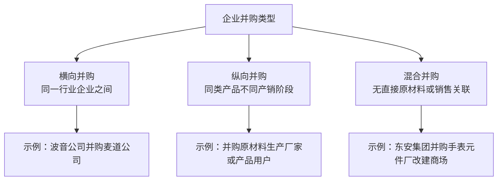
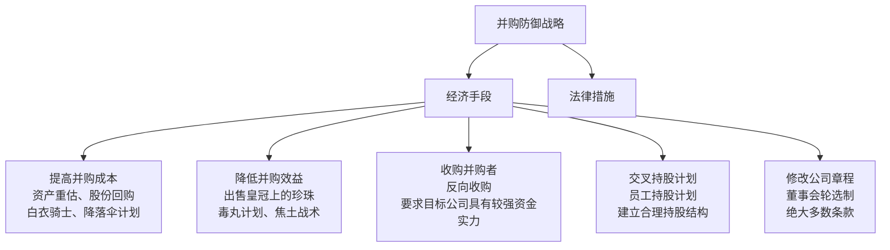
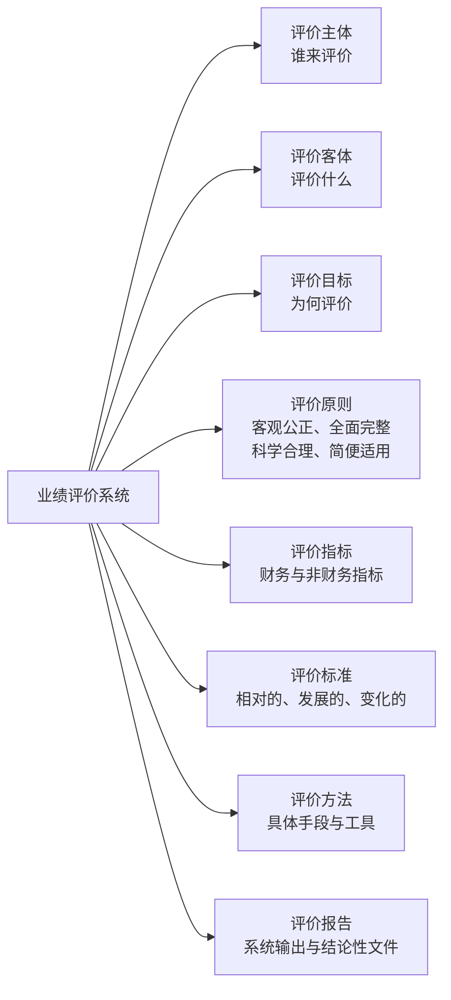
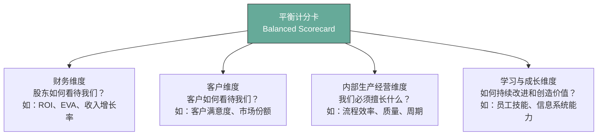

# 高级财务管理复习资料

## 第2章 企业并购基础

### 一、并购的概念与形式

**并购**：在市场机制作用下，企业为了获得其他企业的控制权而进行的产权重组活动。

**常见并购形式及区别：**

| 形式 | 含义 | 被并购方法人资格 |
|------|------|----------------|
| **控股合并** | 收购企业取得对被收购企业的控制权，确认对被收购企业的长期股权投资 | 保留 |
| **吸收合并** | 收购企业取得被收购企业的全部净资产，被收购方资产负债并入收购方 | 注销 |
| **新设合并** | 并购各方法人资格均被注销，重新注册成立一家新企业 | 全部注销，新设 |

---

### 二、并购的类型

**按行业关系划分：**

**按支付方式划分：**
- 现金购买资产或股权
- 股票换取资产或股权
- 通过承担债务换取资产或股权

---

### 三、并购的动因

> [!note] 并购动因的三个维度
> 1. **获得规模经济优势**：通过并购扩大经营规模，降低单位成本
> 2. **降低交易费用**：内部化原本通过市场完成的交易
> 3. **多元化经营策略**：分散企业管理者和员工的人力资本投资风险，充分利用商誉、客户群体、供应商等无形资产

---

## 第3章 并购目标公司的选择

**选择程序：发现 → 审查 → 评价**

**审查阶段需重点关注的五个问题：**

> [!warning] 并购尽职调查关键事项
> 1. **出售动机**：了解目标公司出售原因，判断是否存在隐性风险
> 2. **法律合规性**：资产情况、是否符合国家行业规定及面临的主要法律事项
> 3. **业务融合性**：目标公司业务能否与本公司有效整合
> 4. **财务真实性**：财务数据是否真实可靠
> 5. **并购风险**：可能存在的整合风险、估值风险等

---

## 第4章 并购支付方式与防御战略

### 一、并购支付方式

**三种主要方式：**

| 支付方式 | 含义 |
|----------|------|
| **现金支付** | 主并企业支付现金取得目标企业所有权，目标企业股东即时失去选举权和所有权 |
| **股票支付** | 主并企业增发新股，以新发行的股票替换目标企业股票 |
| **混合证券支付** | 现金、股票、认股权证、可转换债券等多种形式的组合 |

---

**现金支付的优缺点：**

> [!tip] 现金支付特点
> **核心特征：** 即时产生纳税义务；不稀释现有股东控制权；可迅速完成并购。

**优点：**
1. 可迅速直接达到并购目的
2. 估价方式简单
3. 可确保并购公司控制权固化
4. 支付价值稳定

**缺点：**
1. 受公司现金结余的制约，交易规模受限
2. 获现能力差异导致适用范围受限
3. 跨国并购中面临货币可兑换性风险及汇率风险
4. 可能增加目标公司的资本收益税负担

---

**混合证券支付的优势：**

集各种支付工具的长处，弥补单一工具的不足：
- **公司债券**：资金成本较低，利息支出可免税
- **认股权证**：主并企业可延期支付股利；目标企业股东可优先低价认购新股或出售权证
- **可转换债券**：主并企业可以更低利率、更宽松条件出售债券；对目标企业而言兼具安全性和可增值性，可推迟转换时机

---

### 二、杠杆并购（LBO）

**含义：** 并购方以目标公司资产作为抵押，向银行和投资者融资借款完成收购，收购后以目标公司收益或出售其资产偿付本息。

**目标企业应具备的条件：**

> [!info] 杠杆并购成功的四个前提条件
> 1. 具有稳定连续的现金流量
> 2. 拥有人员稳定、责任感强的管理者
> 3. 被并购前资产负债率较低
> 4. 拥有易于出售的非核心资产

---

### 三、管理层收购（MBO）

**含义：** 目标公司管理层利用外部融资购买本公司股份，改变所有者结构、控制权结构和资产结构，重组公司并获得预期收益的收购行为。

**主要方式：**
1. 收购上市公司
2. 收购集团的子公司或分支机构
3. 公营部门的私有化

---

### 四、并购防御战略

**适用场景：** 通常仅在**敌意并购**中，目标公司管理层才会采取防御或抵制措施。

**防御战略分类：**

---

## 第5章 企业集团财务管理

### 一、企业集团财务管理的特点

1. 财务管理的**主体复杂化**
2. 财务管理的基础是**控制**
3. 母子公司之间以**资本**为联系纽带
4. 财务管理更加突出**战略性**

---

### 二、集权与分权的比较

> [!note] 核心概念
> - **集权管理**：经营权限（尤其是决策权）集中在集团最高领导层，下属企业仅保留日常业务决策权和执行权
> - **分权管理**：经营权限和决策权分配给下属企业，集团最高层仅掌握少数关系全局的重大问题决策权

| 维度 | 集权 | 分权 |
|------|------|------|
| **优点** | 决策迅速果断；纵向信息沟通充分；管理者具有权威性 | 节约纵向信息传递时间；决策针对性强；鼓励下级积极性 |
| **缺点** | 压抑下级主动性；横向信息沟通不畅；管理者距前线远，易武断决策 | 重大事项决策速度减慢；信息分散化和不对称；易各自为政，忽视整体利益 |

> [!important] 集权与分权的关系
> 典型的绝对集权或绝对分权均不存在。不同类型、不同时期、不同领域、不同人力资源条件下，企业集团应对集权与分权**各有侧重**。集权是为了形成规模和整体效益，避免资源重复配置；分权是为了靠近市场、降低沟通成本、提高反应速度。

---

## 第6章 企业集团的筹资、投资与资本经营

### 一、企业集团筹资管理的重点

1. 关注集团公司整体**风险水平**
2. 实行筹资权的**集中化管理**
3. 充分发挥企业集团筹资的**各种优势**（规模优势、信用优势、多元化融资渠道）

---

### 二、企业集团投资管理的要点

1. **以投资带动集团发展**：区分生产性投资与战略性投资，明确走多元化还是专业化道路
2. **从母子公司角度分别评价投资项目**：兼顾集团整体利益与子公司个体效益
3. **结合具体情况选择投资评价标准**

---

### 三、企业集团的财务分配

> [!note] 分配方向的转变
> 单体企业中，财务分配方向是从企业法人到企业所有者（正向分配）。
>
> 企业集团中，母公司具有对子公司的实际控制权，财务分配转变为母公司对各子公司的利益协调（**"反向"分配**），管理重点从成果分配转化为**利益协调与激励机制**问题。

---

### 四、资本经营的方式

| 目标 | 具体方式 |
|------|---------|
| **资本扩张** | 并购、股份制改制、上市 |
| **资本收缩** | 资产剥离、公司分立、股权出售、股份回购 |

> [!tip] 资本收缩的含义
> 资本收缩是指收缩对原有资产的**控制权**，而非收缩资本规模本身。

---

## 第7章 业绩评价体系

### 一、业绩评价的作用

**从控制角度：**
1. 在规划中量化企业目标
2. 在战略实施中把握企业战略
3. 构建与战略相适应的激励机制

业绩评价与预算控制相互对应，构成**财务管理循环**，通过信息反馈及时纠正实际业绩与预算的偏差。

**从激励机制角度：** 企业集团多层次委托代理关系中，委托人与代理人存在利益冲突和信息不对称，需通过业绩评价促使经营者选择可增加股东价值的活动。

---

### 二、业绩评价系统的八大要素

---

### 三、财务指标与非财务指标的平衡

> [!important] 为何需要两类指标相结合
> - **财务指标**：反映经济业务的结果，具有综合性，但存在滞后性、短期导向等缺陷
> - **非财务指标**：对财务指标进行补充，能反映客户满意度、流程质量、员工成长等驱动因素
>
> 两者在业绩评价上均存在缺陷，需将二者完美结合，实现短期与长期、财务与非财务的平衡。

---

### 四、责任中心的评价

**责任中心**：企业内部成本、利润、投资发生的单位，责任人被赋予一定权力对该区域进行有效控制。

| 责任中心类型 | 主要考核内容 | 核心指标 |
|-------------|------------|---------|
| **成本中心** | 权责范围内的责任成本（可控成本） | 责任成本（"谁负责谁承担"） |
| **收入中心** | 权责范围内的销售收入 | 销售收入 |
| **利润中心** | 权责范围内的收入和成本 | 边际贡献、息税前利润 |
| **投资中心** | 成本、收入、利润及占用资产 | 投资利润率、剩余收益 |

> [!note] 产品成本 vs 责任成本
> - **产品成本**：以产品为归集对象，原则是"谁受益谁承担"
> - **责任成本**：以责任中心为归集对象，原则是"谁负责谁承担"

---

### 五、平衡计分卡（Balanced Scorecard）

**含义：** 立足于企业战略规划，从**四个维度**综合衡量和评价企业经营业绩：

> [!tip] 平衡计分卡的"平衡"体现在
> - 财务指标与非财务指标的平衡
> - 结果指标与驱动指标的平衡
> - 短期目标与长期目标的平衡
> - 外部视角（财务、客户）与内部视角（流程、学习）的平衡
